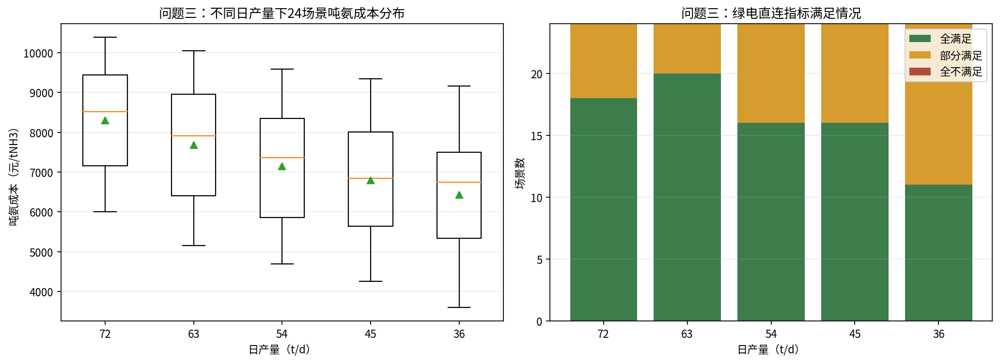

# A题第1-4题详细解答过程

> 本文暂不处理第5题。小时编号 `0` 表示 `0:00-1:00`，以此类推。

## 0. 统一建模口径

### 0.0 符号与变量说明

| 符号 | 含义 | 单位/取值 |
|---|---|---|
| $t$ | 调度时段编号 | $t=0,1,\ldots,23$ |
| $s$ | 风光组合场景编号 | 24 个场景 |
| $p^{load}_t$ | 常规电负荷标幺值 | 无量纲 |
| $p^w_t$ | 风电出力标幺值 | 无量纲 |
| $p^{pv}_t$ | 光伏出力标幺值 | 无量纲 |
| $P^{base}_t$ | 园区常规电负荷功率 | MW |
| $P^w_t$ | 风电实际出力功率 | MW |
| $P^{pv}_t$ | 光伏实际出力功率 | MW |
| $P^{re}_t$ | 新能源总发电功率，$P^w_t+P^{pv}_t$ | MW |
| $P^{proc}_t$ | 制氢氨系统用电功率 | MW |
| $P^{load}_t$ | 园区总用电负荷功率，含常规负荷和制氢氨负荷 | MW |
| $P^{buy}_t$ | 从外部电网购电功率 | MW |
| $P^{sell}_t$ | 向外部电网上网功率 | MW |
| $E^{load}$ | 日总用电量 | MWh |
| $E^{re}$ | 日新能源发电量 | MWh |
| $E^w$ | 日风电发电量 | MWh |
| $E^{pv}$ | 日光伏发电量 | MWh |
| $E^{buy}$ | 日网购电量 | MWh |
| $E^{sell}$ | 日上网电量 | MWh |
| $\eta_1$ | 新能源自发自用电量占总可用发电量比例 | % |
| $\eta_2$ | 总用电量绿电比例 | % |
| $\eta_3$ | 新能源上网电量比例 | % |
| $Q$ | 日制氨产量 | tNH3/d |
| $Q^{NH3}_t$ | 第 $t$ 小时制氨产量 | tNH3/h |
| $x_t$ | 离散调度开停变量，1 表示开机，0 表示停机 | 0/1 |
| $y_t$ | 连续调节负荷率，1 表示满负荷 | 并网连续：$0.1\le y_t\le1$；离网松弛：$0\le y_t\le1$ |
| $C_{day}$ | 日净运行成本 | 元/日 |
| $C_{ton}$ | 吨氨成本 | 元/tNH3 |
| $C_w,C_{pv}$ | 风电、光伏度电成本 | 元/kWh |
| $c^{buy}_t$ | 第 $t$ 小时分时购电电价 | 元/kWh |
| $c^{sell}$ | 余电上网电价 | 元/kWh |
| $C^{om}_{ALK}$ | 碱性电解槽日运维成本 | 元/日 |
| $C^{om}_{PEM}$ | PEM 电解槽日运维成本 | 元/日 |
| $C^{om}_{NH3}$ | 合成氨装置日运维成本 | 元/日 |
| $C^{cap}_{NH3}$ | 合成氨装置日均投资摊销 | 元/日 |
| $P^{res}_t$ | 离网时扣除常规负荷后的剩余风光功率 | MW |
| $P^{ch}_t$ | 储能充电功率 | MW |
| $P^{dis}_t$ | 储能放电功率 | MW |
| $SOC_t$ | 储能在第 $t$ 小时的荷电状态 | MWh |
| $E^{bat}$ | 储能额定容量 | MWh |
| $P^{curt}_t$ | 离网弃电功率 | MW |
| $\eta_c,\eta_d$ | 储能充电效率、放电效率 | % |
| $\lambda$ | 储能小时自损耗率 | %/h |

### 0.1 基础换算

常规负荷：

$$
P^{base}_t=6p^{load}_t
$$

典型日新能源功率：

$$
P^{w}_t=40p^{w}_t,\qquad P^{pv}_t=64p^{pv}_t,\qquad P^{re}_t=P^w_t+P^{pv}_t
$$

36 吨/日初始产能下，电氢氨装置满负荷功率为：

$$
P^{proc}=10+10+0.75=20.75\text{ MW}
$$

72 吨/日扩容后，设备按线性同步扩容，满负荷每小时产氨 `3 t/h`，满负荷功率为：

$$
P^{proc}_{72}=20+20+1.5=41.5\text{ MW}
$$

若扩容后设备负荷率为 $y_t$，则：

$$
P^{proc}_t=41.5y_t,\qquad Q^{NH3}_t=3y_t
$$

### 0.2 功率平衡和指标

并网运行中：

$$
P^{buy}_t=\max(P^{load}_t-P^{re}_t,0),\qquad
P^{sell}_t=\max(P^{re}_t-P^{load}_t,0)
$$

日用电量、新能源发电量、购电量、上网量为：

$$
E^{load}=\sum_tP^{load}_t,\quad
E^{re}=\sum_tP^{re}_t,\quad
E^{buy}=\sum_tP^{buy}_t,\quad
E^{sell}=\sum_tP^{sell}_t
$$

绿电直连指标：

$$
\eta_1=\frac{E^{load}-E^{sell}-E^{buy}}{E^{re}},\quad
\eta_2=\frac{E^{re}-E^{sell}}{E^{load}},\quad
\eta_3=\frac{E^{sell}}{E^{re}}
$$

合格要求为：

$$
\eta_1>60\%,\quad \eta_2>30\%,\quad \eta_3<20\%
$$

### 0.3 成本口径

本文吨氨成本采用日净成本除以日产量。由于功率按 MW、能量按 MWh 统计，而电价和度电成本均为 `元/kWh`，电量成本统一乘以 $1000$：

$$
C_{day}=
1000\left(
C_wE_w+C_{pv}E_{pv}
{}+\sum_t c^{buy}_tP^{buy}_t
{}-c^{sell}E^{sell}
\right)
{}+C^{om}_{ALK}+C^{om}_{PEM}+C^{om}_{NH3}
{}+C^{cap}_{NH3}
$$

$$
C_{ton}=\frac{C_{day}}{Q}
$$

其中：

- 风电度电成本 `0.15 元/kWh`，光伏度电成本 `0.12 元/kWh`。
- 购电按分时电价，余电上网电价为 `0.3779 元/kWh`。
- 碱性电解槽运维 `0.1 元/kWh`，PEM 电解槽运维 `0.15 元/kWh`，合成氨装置运维 `0.002 元/kWh`。
- 合成氨装置投资按寿命 30 年直线摊销。36 吨/日产能对应氢需求能力 `300 kgH2/h`，72 吨/日对应 `600 kgH2/h`。合成氨投资计算另按日氢需求量 `7200/14400 kgH2/d` 折算。
- 注意：上式中功率按 MW、能量按 MWh 统计，而电价和度电成本单位为 `元/kWh`，因此所有电量成本计算均采用 `MWh × 1000 × 元/kWh`。

该口径把已建设风光发电的度电成本计入总成本，同时把上网电量作为收入抵扣。

### 0.4 关键单位核查

除 `MWh` 与 `kWh` 的换算外，本文还采用以下单位理解：

- 电解槽产氢能力与附件 5 一致。碱性电解槽 `10 MW`、效率 `70%`、理论电耗 `50 kWh/kgH2`，产氢量为 $10000\times0.70/50=140\text{ kg/h}$；PEM 电解槽 `10 MW`、效率 `80%`，产氢量为 $10000\times0.80/50=160\text{ kg/h}$。
- 36 吨/日制氨对应氢需求 $36000\times0.2/24=300\text{ kgH2/h}$，正好对应 `140+160=300 kgH2/h`；72 吨/日扩容后对应 `600 kgH2/h`。合成氨投资计算另按日氢需求量 `7200/14400 kgH2/d` 折算。
- 合成氨装置用电 `0.5 kWh/kgNH3`，36 吨/日即 $1500\text{ kg/h}\times0.5=750\text{ kWh/h}=0.75\text{ MW}$，72 吨/日即 `1.5 MW`。
- 合成氨装置投资成本按附件字面 `60000 元/kgH2` 理解，乘以设计日氢需求量得到装置投资基数。36 吨/日对应 `7200 kgH2/d`，72 吨/日对应 `14400 kgH2/d`。
- 储能投资 `1000 元/kWh` 与容量 `MWh` 对应时，采用 $E^{bat}\times1000\text{ kWh/MWh}\times1000\text{ 元/kWh}$。
- 24 个场景每个代表 15 天，因此本文代表年为 `360 天`；合成氨装置和储能投资摊销也统一按 `360 天/年` 年化，避免全年统计为 360 天而设备折旧按 365 天造成口径不一致。

## 1. 问题一：典型风光场景满负荷运行

### 1.1 计算过程

初始 36 吨/日产能下，电解槽与合成氨装置连续满负荷运行，因此：

$$
P^{load}_t=P^{base}_t+20.75
$$

由功率平衡逐小时计算购电与上网功率。负荷与新能源组成曲线见：

购电与上网功率曲线见：

### 1.2 典型日能量与指标

| 指标                           |          数值 |
| ------------------------------ | ------------: |
| 日用电量                       |   558.720 MWh |
| 新能源发电量                   |   603.448 MWh |
| 风电发电量                     |   245.048 MWh |
| 光伏发电量                     |   358.400 MWh |
| 网购电量                       |   172.044 MWh |
| 上网电量                       |   216.772 MWh |
| 新能源自发自用占比$(\eta_1)$ |        28.16% |
| 总用电量绿电比例$(\eta_2)$   |        69.21% |
| 新能源上网比例$(\eta_3)$     |        35.92% |
| 日净成本                       | 195604.16 元/日 |
| 吨氨成本                       | 5433.45 元/tNH3 |

### 1.3 是否满足政策要求

仅“总用电量绿电比例”满足要求，其余两个指标不满足：

- $(\eta_1=28.16\%<60\%)$，说明新能源虽总量较高，但中午光伏高峰与负荷不完全匹配，大量新能源未在园区内消纳。
- $(\eta_3=35.92\%>20\%)$，说明上网比例过高。
- 根本原因是制氢氨装置满负荷连续运行，夜间大量购电，中午光伏高峰又出现余电上网，负荷缺乏跟随风光出力的调节能力。

## 2. 问题二：离散开停制氨调度优化

### 2.1 优化模型

72 吨/日产能下，设备只能全开或全停。定义：

$$
x_t\in\{0,1\}
$$

其中 $x_t=1$ 表示第 $t$ 小时全额开机。日产量从 72 吨/日递减到 36 吨/日，因此开机小时数为：

| 日产量 | 开机小时数 |
| -----: | ---------: |
| 72 t/d |       24 h |
| 63 t/d |       21 h |
| 54 t/d |       18 h |
| 45 t/d |       15 h |
| 36 t/d |       12 h |

对给定日产量，约束为：

$$
\sum_t x_t=Q/3
$$

目标函数为日净成本最小：

$$
\min \ C_{day}
$$

由于同一场景下新能源发电成本固定、同一日产量下制氢氨运维固定，调度本质上是选择“开机后边际购售电成本最低”的若干小时。逐小时边际成本为：

$$
\Delta C_t =
c^{buy}_t\max(P^{base}_t+41.5-P^{re}_t,0)
{}-c^{sell}\max(P^{re}_t-P^{base}_t-41.5,0)
{}-\left[
c^{buy}_t\max(P^{base}_t-P^{re}_t,0)
{}-c^{sell}\max(P^{re}_t-P^{base}_t,0)
\right]
$$

取 $\Delta C_t$ 最小的对应小时开机。

### 2.2 典型风光场景结果

| 日产量 | 最优开机小时      | 购电量/MWh | 上网量/MWh | $\eta_1$ | $\eta_2$ | $\eta_3$ | 吨氨成本/元 | 判定     |
| -----: | ----------------- | ---------: | ---------: | ---------: | ---------: | ---------: | ----------: | -------- |
|     72 | 0-23              |     493.95 |      40.68 |     86.52% |     53.26% |      6.74% |     7330.25 | 全满足   |
|     63 | 0-17,21-23        |     376.04 |      47.27 |     84.33% |     59.66% |      7.83% |     6597.90 | 全满足   |
|     54 | 0-16,23           |     264.14 |      59.87 |     80.16% |     67.30% |      9.92% |     6072.75 | 全满足   |
|     45 | 0-6,8-14,23       |     227.68 |     147.91 |     50.98% |     66.67% |     24.51% |     5722.32 | 部分满足 |
|     36 | 0-6,9,11,12,14,23 |     225.30 |     270.03 |     10.50% |     59.68% |     44.75% |     5413.90 | 部分满足 |

最低吨氨成本出现在 `36 吨/日`。该方案设备利用率为：

$$
u_{ALK}=u_{PEM}=u_{NH3}=\frac{12}{24}=50\%
$$

该低成本方案只有“总用电量绿电比例”达标，自发自用占比和上网比例均不达标。原因是统一单位后，购电成本和制氢运维成本成为主要成本项，降低产量可以显著减少高成本用电；但负荷下降会导致新能源上网增加，绿电直连指标变差。

### 2.3 24 个风光场景结果

第2题第2问要求先分析“每种产量”在 24 个风光场景下的最优调度，而不只是直接选每个场景的最低成本产量。因此这里保留 `72、63、54、45、36 t/d` 五档产量的完整计算结果，共 `5×24=120` 条。完整明细已导出为 `outputs/q2_all_productions_discrete.csv`，其中包含每个场景、每档产量的开机小时、绿电指标、吨氨成本、购电量和上网量。

按产量汇总的 24 场景分布如下。

| 日产量/t | 平均吨氨成本/元 | 最小吨氨成本/元 | 最大吨氨成本/元 | 平均购电/MWh | 平均上网/MWh | 平均自发自用 | 平均绿电比例 | 平均上网比例 |
| -------: | --------------: | --------------: | --------------: | -----------: | -----------: | -----------: | -----------: | -----------: |
| 36 | 6716.04 | 3592.62 | 9347.38 | 297.99 | 215.25 | 17.49% | 46.67% | 41.25% |
| 45 | 7068.09 | 4253.15 | 9481.90 | 355.49 | 148.25 | 42.28% | 47.97% | 28.86% |
| 54 | 7391.14 | 4693.51 | 9709.59 | 417.36 | 85.62 | 67.40% | 48.33% | 16.30% |
| 63 | 7793.12 | 5272.32 | 10066.51 | 509.62 | 53.37 | 82.60% | 45.33% | 8.70% |
| 72 | 8293.78 | 6001.41 | 10384.36 | 614.30 | 33.55 | 91.26% | 41.87% | 4.37% |

按绿电指标合格情况分组如下。

| 日产量/t | 全满足/场景 | 部分满足/场景 | 全不满足/场景 |
| -------: | ----------: | ------------: | ------------: |
| 36 | 0 | 21 | 3 |
| 45 | 1 | 19 | 4 |
| 54 | 14 | 9 | 1 |
| 63 | 14 | 10 | 0 |
| 72 | 18 | 6 | 0 |

由此可见，产量越高，新能源上网比例越低、自发自用占比越高，政策指标更容易满足；但购电量和制氢氨运行成本也随之上升，平均吨氨成本反而提高。完整明细适合作为附录或支撑材料，论文正文更适合用分布图概括 120 条结果。

#### 2.3.1 最优制氨生产时段特征

下图给出了每个日产量下，24 个风光场景中各小时被选为制氨生产时段的频率。颜色越深，表示该小时越稳定地进入最优生产时段。

调度规律为：`36 t/d` 与 `45 t/d` 主要安排在低谷电价时段 `0:00-6:00` 和 `23:00`，这些小时在 24 个场景中均为 `100%` 入选；若产量提高到 `54-63 t/d`，低谷时段已不足以满足生产小时数，模型会进一步选择白天光伏较高或风电较好的时段，如 `8:00-17:00` 的部分小时；`18:00-20:00` 属于高峰电价且风光相对不足，在低、中产量下几乎不被选择。满产 `72 t/d` 则 24 小时均需运行，已无时段优化空间。

#### 2.3.2 吨氨成本与购售电分布

下图用箱线图给出各产量下 24 个场景的吨氨成本、日购电量和日售电量分布。

可以看出，日产量从 `36 t/d` 提高到 `72 t/d` 时，平均吨氨成本从 `6716.04 元/t` 上升到 `8293.78 元/t`，平均日购电量从 `297.99 MWh` 上升到 `614.30 MWh`；同时平均日售电量从 `215.25 MWh` 下降到 `33.55 MWh`。这说明提高产量能减少弃电和上网，但需要更多外购电并承担更高的制氢氨运行成本，因此在当前电价和设备成本参数下，满产并不是最低吨氨成本方案。

#### 2.3.3 绿电直连指标分布

下图分别给出自发自用占比、总用电量绿电比例、上网电量占比三项指标在 24 场景中的分布，并给出三项指标综合判定。

指标变化具有明显的方向性：随产量提高，自发自用占比显著上升，平均值由 `36 t/d` 的 `17.49%` 提高到 `72 t/d` 的 `91.26%`；上网电量占比显著下降，平均值由 `41.25%` 降至 `4.37%`；总用电量绿电比例则在中等产量附近较高，`54 t/d` 平均为 `48.33%`，满产时因购电量增加降至 `41.87%`。因此，`54-72 t/d` 更容易满足绿电直连政策指标，但经济性弱于低产量方案。

箱线图中的离散点按 `Q1-1.5IQR` 和 `Q3+1.5IQR` 规则识别，完整明细已导出为 `outputs/q2_boxplot_outliers.csv`。合并同一产量、同一场景下的重复异常后，主要离散点如下。

| 产量/t | 场景 | 异常指标 | 吨氨成本/元 | 购电/MWh | 上网/MWh | 自发自用 | 绿电比例 | 上网比例 | 判定 |
| -----: | ---- | -------- | ----------: | -------: | -------: | -------: | -------: | -------: | ---- |
| 45 | W4P1 | 上网量偏高 | 4253.15 | 188.95 | 382.66 | 12.73% | 72.34% | 43.64% | 部分满足 |
| 45 | W5P1 | 上网量偏高 | 4525.60 | 212.75 | 348.95 | 14.83% | 68.86% | 42.59% | 部分满足 |
| 54 | W1P1、W3P1、W4P1、W5P1、W6P1 | 上网量偏高 | 4693.51-5398.56 | 188.95-257.43 | 165.47-258.16 | 41.12%-53.76% | 68.13%-76.61% | 23.12%-29.44% | 部分满足 |
| 63 | W1P1、W3P1、W4P1、W5P1 | 上网量偏高、自发自用偏低、上网比例偏高 | 5272.32-5740.00 | 246.83-326.63 | 156.17-192.51 | 53.01%-59.04% | 64.96%-73.52% | 20.48%-23.49% | 部分满足 |
| 63 | W6P1 | 上网量偏高 | 5911.20 | 339.46 | 123.00 | 65.63% | 63.59% | 17.18% | 全满足 |
| 72 | W1P1、W2P1、W3P1、W4P1、W5P1、W6P1 | 上网量偏高、自发自用偏低、上网比例偏高 | 6001.41-6901.38 | 353.50-487.43 | 89.61-173.71 | 60.38%-74.62% | 53.87%-66.55% | 12.69%-19.81% | 全满足 |

这些离散点集中出现在 `P1` 光伏场景，即光伏出力最高的场景；其中 `W4P1、W5P1` 又叠加较高风电出力，因此在 `45-72 t/d` 下仍出现较高上网量。其本质不是成本异常升高，而是高风高光条件下新能源供给超过制氨和常规负荷吸纳能力，导致上网量、上网比例偏高，同时自发自用占比在箱线图口径下偏低。

#### 2.3.4 全年成本分布和总成本

每种风光场景代表 15 天，因此五种固定日产量方案的全年产量、全年总成本和全年平均吨氨成本如下。

| 日产量/t | 全年产量/t | 全年总成本/万元 | 全年平均吨氨成本/元 |
| -------: | ---------: | --------------: | ------------------: |
| 36 | 12960 | 8703.99 | 6716.04 |
| 45 | 16200 | 11450.31 | 7068.09 |
| 54 | 19440 | 14368.37 | 7391.14 |
| 63 | 22680 | 17674.79 | 7793.12 |
| 72 | 25920 | 21497.48 | 8293.78 |

五种日产量下的全年吨氨成本分布曲线见下图。横坐标按 `36 t/d` 的吨氨成本由低到高排序，但仍保留具体风光场景标签。

从图中可以看出，在 24 个场景中，吨氨成本随日产量提高基本单调上升。原因是离散开停模型按边际成本由低到高选择开机小时，日产量越高，需要纳入的生产小时越多，新增小时的边际购售电成本不低于已选小时；同时制氢氨运维成本随运行小时增加，而固定投资摊薄收益不足以抵消新增电力和运维成本。

若进一步按“每个场景选择吨氨成本最低日产量”的经济准则，24 个场景全部选择 `36 吨/日`。这一策略作为经济最优补充分析如下。

年度统计：每个场景代表 15 天。

| 分类     | 场景数 | 天数 |  占比 |
| -------- | -----: | ---: | ----: |
| 全满足   |      0 |    0 |  0.0% |
| 部分满足 |     21 |  315 | 87.5% |
| 全不满足 |      3 |   45 | 12.5% |

该“逐场景最低成本策略”的全年吨氨成本分布见：

全年总产量：

$$
36\times 24\times 15=12960\text{ t}
$$

全年平均吨氨成本：

$$
\bar C=\frac{\sum_s15C_s}{\sum_s15Q_s}=6716.04\text{ 元/tNH3}
$$

全年总成本为：

$$
C_{\text{year}}=8703.99\text{ 万元}
$$

## 3. 问题三：连续制氨调节

### 3.1 优化模型

设扩容后设备负荷率 $y_t$ 连续可调。对给定日产量：

$$
0.1\le y_t\le 1,\qquad \sum_t3y_t=Q
$$

目标函数仍为日净成本最小。由于谷电价 `0.3424 元/kWh` 低于上网价 `0.3779 元/kWh`，不能把购电、售电简单写成可同时为正的线性规划变量，否则会产生“低价购电、高价上网”的数学套利。本文直接使用逐小时分段成本：

$$
f_t(y_t)=c^{buy}_t\max(P^{base}_t+41.5y_t-P^{re}_t,0)
{}-c^{sell}\max(P^{re}_t-P^{base}_t-41.5y_t,0)
$$

并用步长 `0.01` 的动态规划求解连续调节近似最优调度。

### 3.2 典型风光场景结果

| 日产量 | 吨氨成本/元 | 购电/MWh | 上网/MWh | $\eta_1$ | $\eta_2$ | $\eta_3$ | 判定     |
| -----: | ----------: | -------: | -------: | ---------: | ---------: | ---------: | -------- |
|     72 |     7315.03 |   493.95 |    40.68 |     86.52% |     53.26% |      6.74% | 全满足   |
|     63 |     6574.64 |   369.45 |    40.68 |     86.52% |     60.37% |      6.74% | 全满足   |
|     54 |     5992.07 |   244.95 |    40.68 |     86.52% |     69.67% |      6.74% | 全满足   |
|     45 |     5762.06 |   235.27 |   155.50 |     48.46% |     65.56% |     25.77% | 部分满足 |
|     36 |     5478.75 |   235.27 |   280.00 |      7.20% |     57.89% |     46.40% | 部分满足 |

连续调节下，低产量方案可以把更多制氨负荷压到风光高发或低电价时段，因此部分指标相对离散开停更平滑。典型场景按“最低吨氨成本”准则选择 `36 吨/日`。

### 3.3 24 场景年度结果

问题三也先保留 `72、63、54、45、36 t/d` 五档产量在 24 个风光场景下的完整结果，共 `5×24=120` 条。完整明细已导出为 `outputs/q3_all_productions_continuous.csv`。

按产量汇总的 24 场景分布如下。

| 日产量/t | 平均吨氨成本/元 | 最小吨氨成本/元 | 最大吨氨成本/元 | 平均购电/MWh | 平均上网/MWh | 平均自发自用 | 平均绿电比例 | 平均上网比例 |
| -------: | --------------: | --------------: | --------------: | -----------: | -----------: | -----------: | -----------: | -----------: |
| 36 | 6402.15 | 3565.77 | 9134.77 | 253.03 | 170.28 | 46.83% | 54.71% | 26.59% |
| 45 | 6763.63 | 4231.68 | 9321.83 | 304.47 | 97.23 | 72.84% | 55.44% | 13.58% |
| 54 | 7126.47 | 4675.61 | 9569.67 | 381.33 | 49.59 | 87.08% | 52.79% | 6.46% |
| 63 | 7666.03 | 5138.02 | 10026.51 | 489.85 | 33.61 | 91.24% | 47.45% | 4.38% |
| 72 | 8278.56 | 5986.19 | 10369.13 | 614.30 | 33.55 | 91.26% | 41.87% | 4.37% |

按绿电指标合格情况分组如下。

| 日产量/t | 全满足/场景 | 部分满足/场景 | 全不满足/场景 |
| -------: | ----------: | ------------: | ------------: |
| 36 | 11 | 13 | 0 |
| 45 | 16 | 8 | 0 |
| 54 | 16 | 8 | 0 |
| 63 | 20 | 4 | 0 |
| 72 | 18 | 6 | 0 |

24 个场景在最低吨氨成本准则下仍全部选择 `36 吨/日`。与离散开停相比，连续调节可在低产量下保留更高的新能源自用水平，因此绿电指标明显改善。

问题三按经济最优产量选择后的场景分布为：

| 分类     | 场景数 | 天数 |  占比 |
| -------- | -----: | ---: | ----: |
| 全满足   |     11 |  165 | 45.8% |
| 部分满足 |     13 |  195 | 54.2% |
| 全不满足 |      0 |    0 |  0.0% |

全年平均吨氨成本为：

$$
6402.15\text{ 元/tNH3}
$$

全年总产量仍为：

$$
12960\text{ t}
$$

### 3.4 与问题二对比

- 在固定低产量约束下，连续调节比离散开停更灵活。以 `36 t/d` 为例，平均购电量从 `297.99 MWh/d` 降至 `253.03 MWh/d`，平均上网量从 `215.25 MWh/d` 降至 `170.28 MWh/d`。
- 在本题“可选择日产量且以吨氨成本最低”为目标时，两种模型都选择 `36 吨/日`，但连续调节可降低年度平均吨氨成本，约从 `6685.60 元/t` 降至 `6402.15 元/t`。
- 连续调节的价值体现在可以把有限的制氨负荷更精细地布置到风光高发或低电价时段，从而减少高价购电并降低弃电；因此经济最优策略下，绿电指标“全满足”场景数由问题二的 `0` 个提高到问题三的 `11` 个。

问题二、问题三经济最优策略下逐场景吨氨成本对比见下图。

## 4. 问题四：离网运行与储能配置

### 4.1 无储能离网模型

离网时不允许购电和上网。本文优先满足常规负荷，剩余风光功率用于制氢氨：

$$
P^{res}_t=P^{re}_t-P^{base}_t
$$

无储能时：

$$
y_t=\min\left(1,\max\left(0,\frac{P^{res}_t}{41.5}\right)\right)
$$

若 $P^{res}_t<0$，说明该小时常规负荷也无法完全由风光供给。本数据下大多数场景常规负荷可由风光覆盖，但最低出力场景存在少量缺供，最大约 `0.138 MWh/日`。

### 4.2 无储能结果

| 指标                 |           数值 |
| -------------------- | -------------: |
| 日产量最小值         |         7.91 t |
| 日产量最大值         |        46.45 t |
| 全年制氨总量         |      9934.08 t |
| 氢氨年平均产能利用率 |         38.33% |
| 全年平均吨氨成本     | 6879.03 元/tNH3 |
| 全年弃电量           |   12078.72 MWh |
| 常规负荷最大缺供量   |      0.138 MWh/日 |
| 最大弃电场景         |           W4P1 |
| W4P1 弃电量          |  173.71 MWh/日 |

无储能离网的主要问题是“有电时制氨功率上限受限、缺电时无法生产”，导致风光曲线与制氨负荷曲线严重错配。高风高光场景白天弃电明显，低风低光场景产量大幅下降。

按现有风光比例整体放大，若要求 24 个场景每小时均可支撑常规负荷和 72 吨/日满产负荷，则需要满足：

$$
k(P^w_t+P^{pv}_t)\ge P^{base}_t+41.5,\quad \forall t,s
$$

计算得到最小整体放大倍数约为：

$$
k=28.91
$$

对应最小装机估算为：

$$
P^w_{\min}=1156.31\text{ MW},\qquad P^{pv}_{\min}=1850.09\text{ MW}
$$

该结果很大，原因是最差风光场景的夜间风电出力很低且光伏为零；若允许储能、备用电源或需求侧可中断，所需装机会显著降低。

### 4.3 储能配置模型

针对无储能下最大弃电场景 W4P1 配置储能。储能参数：

- 充电效率 `90%`。
- 放电效率 `90%`。
- 自损耗率 `0.2%/h`。
- 投资成本 `1000 元/kWh`，寿命 15 年。
- 运维成本 `0.01 元/kWh`。

储能状态方程：

$$
SOC_t=(1-\lambda)SOC_{t-1}+\eta_cP^{ch}_t-\frac{P^{dis}_t}{\eta_d}
$$

约束：

$$
0\le SOC_t\le E^{bat},\quad P^{ch}_t\ge0,\quad P^{dis}_t\ge0
$$

离网功率平衡：

$$
P^{re}_t+P^{dis}_t=P^{base}_t+41.5y_t+P^{ch}_t+P^{curt}_t
$$

本文采用连续调节松弛求解储能参与调度；若后续论文要求严格体现“运行下限 10% 且可停机”，可把 $y_t=0$ 或 $0.1\le y_t\le1$ 改为混合整数模型。

对 W4P1 扫描正储能容量后，吨氨成本最低的储能容量为：

$$
E^{bat}=155\text{ MWh}
$$

该容量基本消除 W4P1 弃电，并通过提高产量分摊合成氨固定投资。

该容量下 W4P1 的结果为：

| 指标     |       无储能 | 155 MWh 储能 |
| -------- | -----------: | ---------: |
| 日产量   |      46.45 t |      56.45 t |
| 弃电量   |   173.71 MWh |     0.00 MWh |
| 吨氨成本 | 5869.56 元/t |   5681.64 元/t |

### 4.4 24 场景有储能结果

采用 `155 MWh` 储能容量后，24 个场景结果如下。

| 场景 | 无储能产量/t | 无储能成本/元 | 无储能弃电/MWh | 有储能产量/t | 有储能成本/元 | 有储能弃电/MWh |
| ---- | -----------: | ------------: | -------------: | -----------: | ------------: | -------------: |
| W1P1 |         40.9 |       6017.43 |          135.3 |         48.7 |       5951.14 |            0.0 |
| W1P2 |         31.4 |       6337.51 |            7.5 |         31.9 |       7165.90 |            0.0 |
| W1P3 |         20.0 |       8014.71 |            0.0 |         20.0 |       9429.94 |            0.0 |
| W1P4 |         15.3 |       9443.25 |            0.0 |         15.3 |      11289.82 |            0.0 |
| W2P1 |         36.8 |       6085.34 |           89.6 |         42.0 |       6253.50 |            0.0 |
| W2P2 |         24.6 |       7018.78 |            0.0 |         24.5 |       8174.83 |            0.0 |
| W2P3 |         12.6 |      10535.05 |            0.0 |         12.6 |      12796.94 |            0.0 |
| W2P4 |          7.9 |      14795.07 |            0.0 |          7.9 |      18402.64 |            0.0 |
| W3P1 |         42.9 |       5878.74 |          126.4 |         50.2 |       5875.84 |            0.0 |
| W3P2 |         33.1 |       6191.41 |            3.7 |         33.3 |       7013.68 |            0.0 |
| W3P3 |         21.4 |       7739.21 |            0.0 |         21.4 |       9063.17 |            0.0 |
| W3P4 |         16.7 |       8972.82 |            0.0 |         16.7 |      10667.01 |            0.0 |
| W4P1 |         46.4 |       5869.56 |          173.7 |         56.5 |       5681.64 |            0.0 |
| W4P2 |         39.6 |       5811.64 |            9.7 |         40.2 |       6462.17 |            0.0 |
| W4P3 |         28.3 |       6759.31 |            0.0 |         28.3 |       7758.66 |            0.0 |
| W4P4 |         23.7 |       7437.16 |            0.0 |         23.7 |       8633.91 |            0.0 |
| W5P1 |         43.4 |       5967.91 |          158.6 |         52.5 |       5812.52 |            0.0 |
| W5P2 |         35.4 |       6055.23 |            9.9 |         36.0 |       6776.19 |            0.0 |
| W5P3 |         24.2 |       7278.09 |            0.0 |         24.2 |       8449.30 |            0.0 |
| W5P4 |         19.5 |       8224.77 |            0.0 |         19.5 |       9676.64 |            0.0 |
| W6P1 |         40.8 |       5859.86 |           90.8 |         46.0 |       6032.06 |            0.0 |
| W6P2 |         28.7 |       6550.84 |            0.0 |         28.7 |       7538.61 |            0.0 |
| W6P3 |         16.7 |       8866.52 |            0.0 |         16.7 |      10563.94 |            0.0 |
| W6P4 |         12.0 |      11022.30 |            0.0 |         12.0 |      13380.37 |            0.0 |

年度汇总：

| 指标             |       无储能 | 155 MWh 储能 |
| ---------------- | -----------: | ----------: |
| 全年制氨总量     |    9934.08 t |   10630.74 t |
| 年平均产能利用率 |       38.33% |       41.01% |
| 全年平均吨氨成本 | 6879.03 元/t | 7516.68 元/t |
| 全年弃电量       | 12078.72 MWh |     0.00 MWh |

在当前成本参数下，储能的系统价值主要体现为减少弃电和略微提高产量，但经济性不明显。低风低光场景本身没有弃电，储能只能增加投资成本；高风高光场景虽然可转移部分电量，但电储能投资摊销较高，因此年度平均吨氨成本略升。

### 4.5 离网与并网经济性对比

在相同 24 场景、每场景 15 天的年度口径下，先给出直接汇总对比：

| 模式                    | 年产量/t | 平均吨氨成本/元 | 产能利用率 | 主要特征                           |
| ----------------------- | -------: | --------------: | ---------: | ---------------------------------- |
| 并网，离散经济最优      | 12960.00 |        6685.60 |     50.00% | 选择低产量以降低购电和运维成本     |
| 并网，连续经济最优      | 12960.00 |        6402.15 |     50.00% | 低产量下调度更精细，指标更好       |
| 离网，无储能            |  9934.08 |        6879.03 |     38.33% | 受风光波动限制，弃电与低产并存     |
| 离网，155 MWh 储能      | 10630.74 |        7516.68 |     41.01% | 消除弃电并提高产量，但储能投资较高   |
| 并网，同离网储能产量    | 10631.25 |        6285.00 |     41.02% | 按离网储能各场景产量作为需求曲线   |

其中“并网，同离网储能产量”是为满足题干“相同制氨产量需求”单独计算的严格对照：把 `155 MWh` 储能离网方案在每个风光场景下的日产量作为该场景制氨需求，再用并网连续调节模型计算相同需求下的购售电和吨氨成本。由于连续调节步长为 `0.01`，年产量为 `10631.25 t`，与离网储能方案 `10630.74 t` 的差异仅来自离散步长近似。

结论：按 `60000 元/kgH2` 口径重算后，并网模式仍不是满产最低成本，而是低产量运行更经济；连续调节相对离散开停具有更好的经济性和绿电指标。离网无储能方案年产量和产能利用率明显偏低。储能能提供削峰填谷和弃电消纳价值，并把离网年产量从 `9934.08 t` 提高到 `10630.74 t`，但在当前 `1000 元/kWh` 投资成本下，离网储能的年平均吨氨成本为 `7516.68 元/t`，显著高于同产量需求下的并网连续方案 `6285.00 元/t`。因此储能的系统支撑价值主要体现在能源自给、弃电消纳和离网可运行性，而非当前参数下的直接吨氨成本优势。
