# A题第1-4题详细解答过程

> 本文暂不处理第5题。小时编号 `0` 表示 `0:00-1:00`，以此类推。

## 0. 统一建模口径

### 0.0 符号与变量说明

| 符号 | 含义 | 单位/取值 |
|---|---|---|
| $t$ | 调度时段编号 | $t=0,1,\ldots,23$ |
| $s$ | 风光组合场景编号 | 24 个场景 |
| $p^{load}_t$ | 常规电负荷标幺值 | 无量纲 |
| $p^w_t$ | 风电出力标幺值 | 无量纲 |
| $p^{pv}_t$ | 光伏出力标幺值 | 无量纲 |
| $P^{base}_t$ | 园区常规电负荷功率 | MW |
| $P^w_t$ | 风电实际出力功率 | MW |
| $P^{pv}_t$ | 光伏实际出力功率 | MW |
| $P^{re}_t$ | 新能源总发电功率，$P^w_t+P^{pv}_t$ | MW |
| $P^{proc}_t$ | 制氢氨系统用电功率 | MW |
| $P^{load}_t$ | 园区总用电负荷功率，含常规负荷和制氢氨负荷 | MW |
| $P^{buy}_t$ | 从外部电网购电功率 | MW |
| $P^{sell}_t$ | 向外部电网上网功率 | MW |
| $E^{load}$ | 日总用电量 | MWh |
| $E^{re}$ | 日新能源发电量 | MWh |
| $E^w$ | 日风电发电量 | MWh |
| $E^{pv}$ | 日光伏发电量 | MWh |
| $E^{buy}$ | 日网购电量 | MWh |
| $E^{sell}$ | 日上网电量 | MWh |
| $\eta_1$ | 新能源自发自用电量占总可用发电量比例 | % |
| $\eta_2$ | 总用电量绿电比例 | % |
| $\eta_3$ | 新能源上网电量比例 | % |
| $Q$ | 日制氨产量 | tNH3/d |
| $Q^{NH3}_t$ | 第 $t$ 小时制氨产量 | tNH3/h |
| $x_t$ | 问题二离散调度开停变量，1 表示开机，0 表示停机 | 0/1 |
| $y_t$ | 制氨装置负荷率，1 表示满负荷 | 并网连续：$0.1\le y_t\le1$；离网开机时：$0.1\le y_t\le1$，停机时 $y_t=0$ |
| $z_t$ | 问题四离网半连续开停变量，1 表示开机，0 表示停机 | 0/1 |
| $C_{day}$ | 日净运行成本 | 元/日 |
| $C_{ton}$ | 吨氨成本 | 元/tNH3 |
| $C_w,C_{pv}$ | 风电、光伏度电成本 | 元/kWh |
| $c^{buy}_t$ | 第 $t$ 小时分时购电电价 | 元/kWh |
| $c^{sell}$ | 余电上网电价 | 元/kWh |
| $C^{om}_{ALK}$ | 碱性电解槽日运维成本 | 元/日 |
| $C^{om}_{PEM}$ | PEM 电解槽日运维成本 | 元/日 |
| $C^{om}_{NH3}$ | 合成氨装置日运维成本 | 元/日 |
| $C^{cap}_{NH3}$ | 合成氨装置日均投资摊销 | 元/日 |
| $P^{res}_t$ | 离网时扣除常规负荷后的剩余风光功率 | MW |
| $P^{ch}_t$ | 储能充电功率 | MW |
| $P^{dis}_t$ | 储能放电功率 | MW |
| $SOC_t$ | 储能在第 $t$ 小时的荷电状态 | MWh |
| $E^{bat}$ | 储能额定容量 | MWh |
| $P^{curt}_t$ | 离网弃电功率 | MW |
| $P^{loss}_t$ | 离网常规负荷缺供松弛功率 | MW |
| $\eta_c,\eta_d$ | 储能充电效率、放电效率 | % |
| $\lambda$ | 储能小时自损耗率 | %/h |

### 0.1 基础换算

常规负荷：

$$
P^{base}_t=6p^{load}_t
$$

典型日新能源功率：

$$
P^{w}_t=40p^{w}_t,\qquad P^{pv}_t=64p^{pv}_t,\qquad P^{re}_t=P^w_t+P^{pv}_t
$$

36 吨/日初始产能下，电氢氨装置满负荷功率为：

$$
P^{proc}=10+10+0.75=20.75\text{ MW}
$$

72 吨/日扩容后，设备按线性同步扩容，满负荷每小时产氨 `3 t/h`，满负荷功率为：

$$
P^{proc}_{72}=20+20+1.5=41.5\text{ MW}
$$

若扩容后设备负荷率为 $y_t$，则：

$$
P^{proc}_t=41.5y_t,\qquad Q^{NH3}_t=3y_t
$$

### 0.2 功率平衡和指标

并网运行中：

$$
P^{buy}_t=\max(P^{load}_t-P^{re}_t,0),\qquad
P^{sell}_t=\max(P^{re}_t-P^{load}_t,0)
$$

日用电量、新能源发电量、购电量、上网量为：

$$
E^{load}=\sum_tP^{load}_t,\quad
E^{re}=\sum_tP^{re}_t,\quad
E^{buy}=\sum_tP^{buy}_t,\quad
E^{sell}=\sum_tP^{sell}_t
$$

绿电直连指标：

$$
\eta_1=\frac{E^{load}-E^{sell}-E^{buy}}{E^{re}},\quad
\eta_2=\frac{E^{re}-E^{sell}}{E^{load}},\quad
\eta_3=\frac{E^{sell}}{E^{re}}
$$

合格要求为：

$$
\eta_1>60\%,\quad \eta_2>30\%,\quad \eta_3<20\%
$$

### 0.3 成本口径

本文吨氨成本采用日净成本除以日产量。由于功率按 MW、能量按 MWh 统计，而电价和度电成本均为 `元/kWh`，电量成本统一乘以 $1000$：

$$
C_{day}=
1000\left(
C_wE_w+C_{pv}E_{pv}
{}+\sum_t c^{buy}_tP^{buy}_t
{}-c^{sell}E^{sell}
\right)
{}+C^{om}_{ALK}+C^{om}_{PEM}+C^{om}_{NH3}
{}+C^{cap}_{NH3}
$$

$$
C_{ton}=\frac{C_{day}}{Q}
$$

其中制氢氨设备运维成本按实际运行功率计算。若第 $t$ 小时负荷率为 $y_t$，则 72 吨/日扩容后：

$$
\begin{aligned}
C^{om}_{ALK}&=1000\sum_t 20y_t\times0.1,\\
C^{om}_{PEM}&=1000\sum_t 20y_t\times0.15,\\
C^{om}_{NH3}&=1000\sum_t 1.5y_t\times0.002.
\end{aligned}
$$

36 吨/日初始产能满负荷运行时，上式中的 $20y_t,20y_t,1.5y_t$ 分别替换为 $10,10,0.75$。合成氨装置投资日摊销按设计日氢需求折算：

$$
C^{cap}_{NH3}=\frac{D^{H2}_{design}\times60000}{30\times360}
$$

其中 $D^{H2}_{design}$ 为合成氨装置设计日耗氢量，36 吨/日对应 $7200\text{ kgH2/d}$，72 吨/日对应 $14400\text{ kgH2/d}$。这里采用 `360` 天代表年，是因为 24 个风光场景各代表 15 天。

其中：

- 风电度电成本 `0.15 元/kWh`，光伏度电成本 `0.12 元/kWh`。
- 购电按分时电价，余电上网电价为 `0.3779 元/kWh`。
- 碱性电解槽运维 `0.1 元/kWh`，PEM 电解槽运维 `0.15 元/kWh`，合成氨装置运维 `0.002 元/kWh`。
- 合成氨装置投资按寿命 30 年直线摊销。36 吨/日产能对应氢需求能力 `300 kgH2/h`，72 吨/日对应 `600 kgH2/h`。合成氨投资计算另按日氢需求量 `7200/14400 kgH2/d` 折算。
- 注意：上式中功率按 MW、能量按 MWh 统计，而电价和度电成本单位为 `元/kWh`，因此所有电量成本计算均采用 `MWh × 1000 × 元/kWh`。

该口径把已建设风光发电的度电成本计入总成本，同时把上网电量作为收入抵扣。

若涉及 24 个风光场景的全年统计，统一采用：

$$
Q_{\text{year}}=\sum_s 15Q_s,\qquad
C_{\text{year}}=\sum_s15C_{s,day},\qquad
\bar C_{ton}=\frac{C_{\text{year}}}{Q_{\text{year}}}
$$

年平均产能利用率按 72 吨/日设计产能计算：

$$
u_{\text{year}}=\frac{Q_{\text{year}}}{72\times360}
$$

### 0.4 关键单位核查

除 `MWh` 与 `kWh` 的换算外，本文还采用以下单位理解：

- 电解槽产氢能力与附件 5 一致。碱性电解槽 `10 MW`、效率 `70%`、理论电耗 `50 kWh/kgH2`，产氢量为 $10000\times0.70/50=140\text{ kg/h}$；PEM 电解槽 `10 MW`、效率 `80%`，产氢量为 $10000\times0.80/50=160\text{ kg/h}$。
- 36 吨/日制氨对应氢需求 $36000\times0.2/24=300\text{ kgH2/h}$，正好对应 `140+160=300 kgH2/h`；72 吨/日扩容后对应 `600 kgH2/h`。合成氨投资计算另按日氢需求量 `7200/14400 kgH2/d` 折算。
- 合成氨装置用电 `0.5 kWh/kgNH3`，36 吨/日即 $1500\text{ kg/h}\times0.5=750\text{ kWh/h}=0.75\text{ MW}$，72 吨/日即 `1.5 MW`。
- 合成氨装置投资成本按附件字面 `60000 元/kgH2` 理解，乘以设计日氢需求量得到装置投资基数。36 吨/日对应 `7200 kgH2/d`，72 吨/日对应 `14400 kgH2/d`。
- 储能投资 `1000 元/kWh` 与容量 `MWh` 对应时，采用 $E^{bat}\times1000\text{ kWh/MWh}\times1000\text{ 元/kWh}$。
- 24 个场景每个代表 15 天，因此本文代表年为 `360 天`；合成氨装置和储能投资摊销也统一按 `360 天/年` 年化，避免全年统计为 360 天而设备折旧按 365 天造成口径不一致。

## 1. 问题一：典型风光场景满负荷运行

### 1.1 计算过程

初始 36 吨/日产能下，电解槽与合成氨装置连续满负荷运行，因此：

$$
P^{load}_t=P^{base}_t+20.75
$$

由功率平衡逐小时计算购电与上网功率。负荷与新能源组成曲线见：

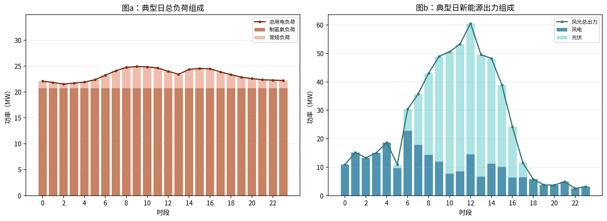

购电与上网功率曲线见：

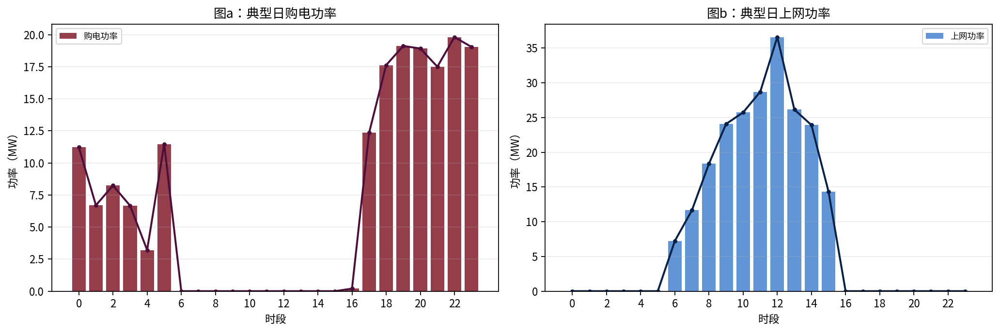

### 1.2 典型日能量与指标

典型日各能量由逐小时功率求和得到。例如：

$$
E^{load}=\sum_t\left(P^{base}_t+20.75\right),\quad
E^w=\sum_t40p^w_t,\quad
E^{pv}=\sum_t64p^{pv}_t
$$

购电量和上网量为：

$$
E^{buy}=\sum_t\max(P^{load}_t-P^{re}_t,0),\qquad
E^{sell}=\sum_t\max(P^{re}_t-P^{load}_t,0)
$$

日产氨量为 $Q=36\text{ t}$，代入 0.2 节绿电指标公式和 0.3 节成本公式，得到：

| 指标                           |          数值 |
| ------------------------------ | ------------: |
| 日用电量                       |   558.720 MWh |
| 新能源发电量                   |   603.448 MWh |
| 风电发电量                     |   245.048 MWh |
| 光伏发电量                     |   358.400 MWh |
| 网购电量                       |   172.044 MWh |
| 上网电量                       |   216.772 MWh |
| 新能源自发自用占比$(\eta_1)$ |        28.16% |
| 总用电量绿电比例$(\eta_2)$   |        69.21% |
| 新能源上网比例$(\eta_3)$     |        35.92% |
| 日净成本                       | 195604.16 元/日 |
| 吨氨成本                       | 5433.45 元/tNH3 |

其中吨氨成本计算为：

$$
C_{ton}=\frac{195604.16}{36}=5433.45\text{ 元/tNH3}
$$

### 1.3 是否满足政策要求

仅“总用电量绿电比例”满足要求，其余两个指标不满足：

- $(\eta_1=28.16\%<60\%)$，说明新能源虽总量较高，但中午光伏高峰与负荷不完全匹配，大量新能源未在园区内消纳。
- $(\eta_3=35.92\%>20\%)$，说明上网比例过高。
- 根本原因是制氢氨装置满负荷连续运行，夜间大量购电，中午光伏高峰又出现余电上网，负荷缺乏跟随风光出力的调节能力。

## 2. 问题二：离散开停制氨调度优化

### 2.1 优化模型

72 吨/日产能下，设备只能全开或全停。定义：

$$
x_t\in\{0,1\}
$$

其中 $x_t=1$ 表示第 $t$ 小时全额开机。日产量从 72 吨/日递减到 36 吨/日，因此开机小时数为：

| 日产量 | 开机小时数 |
| -----: | ---------: |
| 72 t/d |       24 h |
| 63 t/d |       21 h |
| 54 t/d |       18 h |
| 45 t/d |       15 h |
| 36 t/d |       12 h |

对给定日产量，约束为：

$$
\sum_t x_t=Q/3
$$

第 $t$ 小时园区总负荷、购电功率和上网功率为：

$$
P^{load}_t=P^{base}_t+41.5x_t
$$

$$
P^{buy}_t=\max(P^{base}_t+41.5x_t-P^{re}_t,0),\qquad
P^{sell}_t=\max(P^{re}_t-P^{base}_t-41.5x_t,0)
$$

目标函数为日净成本最小：

$$
\min_{x_t}\ C_{day}(x)
$$

其中：

$$
\begin{aligned}
C_{day}(x)=&\ 1000C_w\sum_tP^w_t+1000C_{pv}\sum_tP^{pv}_t\\
&+1000\sum_tc^{buy}_tP^{buy}_t-1000c^{sell}\sum_tP^{sell}_t\\
&+1000\sum_t(20x_t\times0.1+20x_t\times0.15+1.5x_t\times0.002)
+C^{cap}_{NH3}.
\end{aligned}
$$

由于同一场景下新能源发电成本固定、同一日产量下制氢氨运维固定，调度本质上是选择“开机后边际购售电成本最低”的若干小时。逐小时边际成本为：

$$
\Delta C_t =
c^{buy}_t\max(P^{base}_t+41.5-P^{re}_t,0)
{}-c^{sell}\max(P^{re}_t-P^{base}_t-41.5,0)
{}-\left[
c^{buy}_t\max(P^{base}_t-P^{re}_t,0)
{}-c^{sell}\max(P^{re}_t-P^{base}_t,0)
\right]
$$

取 $\Delta C_t$ 最小的对应小时开机。

### 2.2 典型风光场景结果

| 日产量 | 最优开机小时      | 购电量/MWh | 上网量/MWh | $\eta_1$ | $\eta_2$ | $\eta_3$ | 吨氨成本/(元/t) | 判定     |
| -----: | ----------------- | ---------: | ---------: | ---------: | ---------: | ---------: | ----------: | -------- |
|     72 | 0-23              |     493.95 |      40.68 |     86.52% |     53.26% |      6.74% |     7330.25 | 全满足   |
|     63 | 0-17,21-23        |     376.04 |      47.27 |     84.33% |     59.66% |      7.83% |     6597.90 | 全满足   |
|     54 | 0-16,23           |     264.14 |      59.87 |     80.16% |     67.30% |      9.92% |     6072.75 | 全满足   |
|     45 | 0-6,8-14,23       |     227.68 |     147.91 |     50.98% |     66.67% |     24.51% |     5722.32 | 部分满足 |
|     36 | 0-6,9,11,12,14,23 |     225.30 |     270.03 |     10.50% |     59.68% |     44.75% |     5413.90 | 部分满足 |

最低吨氨成本出现在 `36 吨/日`。该方案设备利用率为：

$$
u_{ALK}=u_{PEM}=u_{NH3}=\frac{12}{24}=50\%
$$

该低成本方案只有“总用电量绿电比例”达标，自发自用占比和上网比例均不达标。原因是统一单位后，购电成本和制氢运维成本成为主要成本项，降低产量可以显著减少高成本用电；但负荷下降会导致新能源上网增加，绿电直连指标变差。

### 2.3 24 个风光场景结果

第2题第2问要求先分析“每种产量”在 24 个风光场景下的最优调度，而不只是直接选每个场景的最低成本产量。因此这里保留 `72、63、54、45、36 t/d` 五档产量的完整计算结果，共 `5×24=120` 条。完整明细已导出为 `outputs/q2_all_productions_discrete.csv`，其中包含每个场景、每档产量的开机小时、绿电指标、吨氨成本、购电量和上网量。

对每个场景 $s$、每个给定日产量 $Q$，均求解一次上述离散优化模型，得到最优开机序列 $x_{s,t}^{*}(Q)$。对应指标按下式计算：

$$
E^{buy}_{s,Q}=\sum_tP^{buy}_{s,t},\quad
E^{sell}_{s,Q}=\sum_tP^{sell}_{s,t},\quad
C_{s,Q}^{ton}=\frac{C_{s,Q}^{day}}{Q}
$$

各产量在 24 场景下的平均值、最大值、最小值用于描述分布特征；全年量按每场景 15 天加权。

对任一指标 $I_{s,Q}$，表中“平均、最小、最大”分别按：

$$
\bar I_Q=\frac1{24}\sum_sI_{s,Q},\qquad
I^{\min}_Q=\min_s I_{s,Q},\qquad
I^{\max}_Q=\max_s I_{s,Q}
$$

绿电指标分类场景数按：

$$
N^{full}_Q=\sum_s\mathbf 1(\eta_{1,s,Q}>60\%,\eta_{2,s,Q}>30\%,\eta_{3,s,Q}<20\%)
$$

若三项均不满足，则计入“全不满足”；其余情况计入“部分满足”。

按产量汇总的 24 场景分布如下。

| 日产量/t | 平均吨氨成本/(元/t) | 最小吨氨成本/(元/t) | 最大吨氨成本/(元/t) | 平均购电/MWh | 平均上网/MWh | 平均自发自用 | 平均绿电比例 | 平均上网比例 |
| -------: | --------------: | --------------: | --------------: | -----------: | -----------: | -----------: | -----------: | -----------: |
| 36 | 6716.04 | 3592.62 | 9347.38 | 297.99 | 215.25 | 17.49% | 46.67% | 41.25% |
| 45 | 7068.09 | 4253.15 | 9481.90 | 355.49 | 148.25 | 42.28% | 47.97% | 28.86% |
| 54 | 7391.14 | 4693.51 | 9709.59 | 417.36 | 85.62 | 67.40% | 48.33% | 16.30% |
| 63 | 7793.12 | 5272.32 | 10066.51 | 509.62 | 53.37 | 82.60% | 45.33% | 8.70% |
| 72 | 8293.78 | 6001.41 | 10384.36 | 614.30 | 33.55 | 91.26% | 41.87% | 4.37% |

按绿电指标合格情况分组如下。

| 日产量/t | 全满足/场景 | 部分满足/场景 | 全不满足/场景 |
| -------: | ----------: | ------------: | ------------: |
| 36 | 0 | 21 | 3 |
| 45 | 1 | 19 | 4 |
| 54 | 14 | 9 | 1 |
| 63 | 14 | 10 | 0 |
| 72 | 18 | 6 | 0 |

由此可见，产量越高，新能源上网比例越低、自发自用占比越高，政策指标更容易满足；但购电量和制氢氨运行成本也随之上升，平均吨氨成本反而提高。完整明细适合作为附录或支撑材料，论文正文更适合用分布图概括 120 条结果。

#### 2.3.1 最优制氨生产时段特征

下图给出了每个日产量下，24 个风光场景中各小时被选为制氨生产时段的频率。颜色越深，表示该小时越稳定地进入最优生产时段。

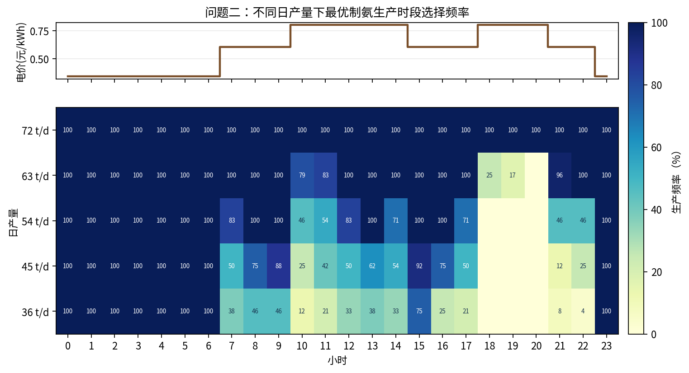

调度规律为：`36 t/d` 与 `45 t/d` 主要安排在低谷电价时段 `0:00-6:00` 和 `23:00`，这些小时在 24 个场景中均为 `100%` 入选；若产量提高到 `54-63 t/d`，低谷时段已不足以满足生产小时数，模型会进一步选择白天光伏较高或风电较好的时段，如 `8:00-17:00` 的部分小时；`18:00-20:00` 属于高峰电价且风光相对不足，在低、中产量下几乎不被选择。满产 `72 t/d` 则 24 小时均需运行，已无时段优化空间。

#### 2.3.2 吨氨成本与购售电分布

下图用箱线图给出各产量下 24 个场景的吨氨成本、日购电量和日售电量分布。

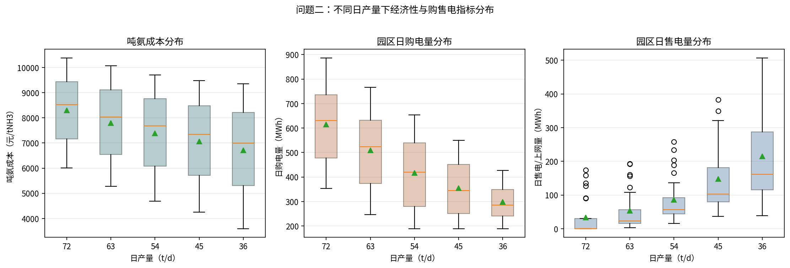

可以看出，日产量从 `36 t/d` 提高到 `72 t/d` 时，平均吨氨成本从 `6716.04 元/t` 上升到 `8293.78 元/t`，平均日购电量从 `297.99 MWh` 上升到 `614.30 MWh`；同时平均日售电量从 `215.25 MWh` 下降到 `33.55 MWh`。这说明提高产量能减少弃电和上网，但需要更多外购电并承担更高的制氢氨运行成本，因此在当前电价和设备成本参数下，满产并不是最低吨氨成本方案。

#### 2.3.3 绿电直连指标分布

下图分别给出自发自用占比、总用电量绿电比例、上网电量占比三项指标在 24 场景中的分布，并给出三项指标综合判定。

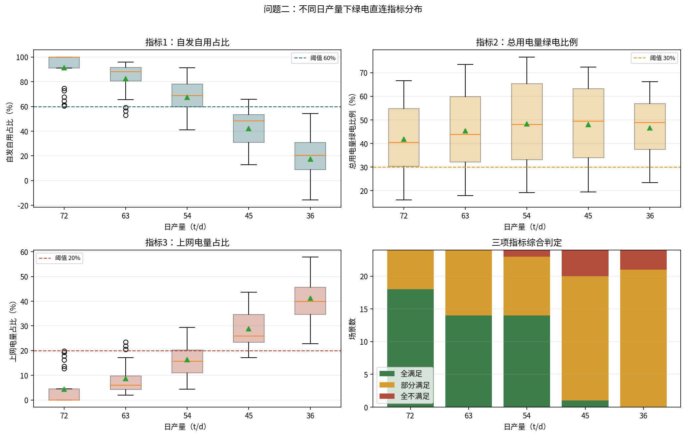

指标变化具有明显的方向性：随产量提高，自发自用占比显著上升，平均值由 `36 t/d` 的 `17.49%` 提高到 `72 t/d` 的 `91.26%`；上网电量占比显著下降，平均值由 `41.25%` 降至 `4.37%`；总用电量绿电比例则在中等产量附近较高，`54 t/d` 平均为 `48.33%`，满产时因购电量增加降至 `41.87%`。因此，`54-72 t/d` 更容易满足绿电直连政策指标，但经济性弱于低产量方案。

箱线图中的离散点按 `Q1-1.5IQR` 和 `Q3+1.5IQR` 规则识别，完整明细已导出为 `outputs/q2_boxplot_outliers.csv`。合并同一产量、同一场景下的重复异常后，主要离散点如下。

| 产量/t | 场景 | 异常指标 | 吨氨成本/(元/t) | 购电/MWh | 上网/MWh | 自发自用 | 绿电比例 | 上网比例 | 判定 |
| -----: | ---- | -------- | ----------: | -------: | -------: | -------: | -------: | -------: | ---- |
| 45 | W4P1 | 上网量偏高 | 4253.15 | 188.95 | 382.66 | 12.73% | 72.34% | 43.64% | 部分满足 |
| 45 | W5P1 | 上网量偏高 | 4525.60 | 212.75 | 348.95 | 14.83% | 68.86% | 42.59% | 部分满足 |
| 54 | W1P1、W3P1、W4P1、W5P1、W6P1 | 上网量偏高 | 4693.51-5398.56 | 188.95-257.43 | 165.47-258.16 | 41.12%-53.76% | 68.13%-76.61% | 23.12%-29.44% | 部分满足 |
| 63 | W1P1、W3P1、W4P1、W5P1 | 上网量偏高、自发自用偏低、上网比例偏高 | 5272.32-5740.00 | 246.83-326.63 | 156.17-192.51 | 53.01%-59.04% | 64.96%-73.52% | 20.48%-23.49% | 部分满足 |
| 63 | W6P1 | 上网量偏高 | 5911.20 | 339.46 | 123.00 | 65.63% | 63.59% | 17.18% | 全满足 |
| 72 | W1P1、W2P1、W3P1、W4P1、W5P1、W6P1 | 上网量偏高、自发自用偏低、上网比例偏高 | 6001.41-6901.38 | 353.50-487.43 | 89.61-173.71 | 60.38%-74.62% | 53.87%-66.55% | 12.69%-19.81% | 全满足 |

这些离散点集中出现在 `P1` 光伏场景，即光伏出力最高的场景；其中 `W4P1、W5P1` 又叠加较高风电出力，因此在 `45-72 t/d` 下仍出现较高上网量。其本质不是成本异常升高，而是高风高光条件下新能源供给超过制氨和常规负荷吸纳能力，导致上网量、上网比例偏高，同时自发自用占比在箱线图口径下偏低。

#### 2.3.4 全年成本分布和总成本

每种风光场景代表 15 天，因此五种固定日产量方案的全年产量、全年总成本和全年平均吨氨成本如下。

对固定日产量 $Q$，全年产量为：

$$
Q_{\text{year}}(Q)=24\times15\times Q=360Q
$$

全年总成本和平均吨氨成本为：

$$
C_{\text{year}}(Q)=\sum_s15C_{s,Q}^{day},\qquad
\bar C_{ton}(Q)=\frac{C_{\text{year}}(Q)}{360Q}
$$

| 日产量/t | 全年产量/t | 全年总成本/万元 | 全年平均吨氨成本/(元/t) |
| -------: | ---------: | --------------: | ------------------: |
| 36 | 12960 | 8703.99 | 6716.04 |
| 45 | 16200 | 11450.31 | 7068.09 |
| 54 | 19440 | 14368.37 | 7391.14 |
| 63 | 22680 | 17674.79 | 7793.12 |
| 72 | 25920 | 21497.48 | 8293.78 |

五种日产量下的全年吨氨成本分布曲线见下图。横坐标按 `36 t/d` 的吨氨成本由低到高排序，但仍保留具体风光场景标签。

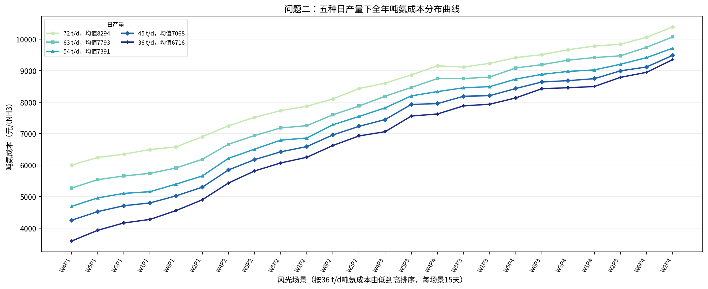

从图中可以看出，在 24 个场景中，吨氨成本随日产量提高基本单调上升。原因是离散开停模型按边际成本由低到高选择开机小时，日产量越高，需要纳入的生产小时越多，新增小时的边际购售电成本不低于已选小时；同时制氢氨运维成本随运行小时增加，而固定投资摊薄收益不足以抵消新增电力和运维成本。

若进一步按“每个场景选择吨氨成本最低日产量”的经济准则，24 个场景全部选择 `36 吨/日`。这一策略作为经济最优补充分析如下。

年度统计：每个场景代表 15 天。

| 分类     | 场景数 | 天数 |  占比 |
| -------- | -----: | ---: | ----: |
| 全满足   |      0 |    0 |  0.0% |
| 部分满足 |     21 |  315 | 87.5% |
| 全不满足 |      3 |   45 | 12.5% |

该“逐场景最低成本策略”的全年吨氨成本分布见：

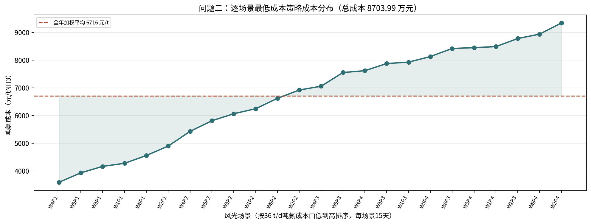

全年总产量：

$$
36\times 24\times 15=12960\text{ t}
$$

全年平均吨氨成本：

$$
\bar C=\frac{\sum_s15C_s}{\sum_s15Q_s}=6716.04\text{ 元/tNH3}
$$

全年总成本为：

$$
C_{\text{year}}=8703.99\text{ 万元}
$$

## 3. 问题三：连续制氨调节

### 3.1 优化模型

问题三将制氨用电由问题二的“整小时开停”改为连续可调。设第 $t$ 小时制氢与合成氨负荷率为 $y_t$，扩容后满负荷制氢与合成氨总功率为 $41.5\text{ MW}$。对给定日产量 $Q$，约束为：

$$
0.1\le y_t\le 1,\qquad \sum_{t=0}^{23}3y_t=Q
$$

其中 $3\text{ t/h}$ 是 `72 t/d` 满负荷制氨能力。目标函数仍为日净成本最小。由于谷电价 `0.3424 元/kWh` 低于上网价 `0.3779 元/kWh`，不能把购电量和上网量同时作为可自由取正的线性变量，否则会出现“低价购电、高价上网”的数学套利。本文直接采用逐小时分段购售电成本：

$$
f_t(y_t)=c_t^{buy}\max(P_t^{base}+41.5y_t-P_t^{re},0)
-c^{sell}\max(P_t^{re}-P_t^{base}-41.5y_t,0)
$$

其中 $P_t^{base}$ 为园区常规负荷，$P_t^{re}$ 为风电与光伏出力之和。完整目标函数可写为：

$$
\begin{aligned}
\min_{y_t}\ C_{day}(y)=&\ 1000C_w\sum_tP^w_t+1000C_{pv}\sum_tP^{pv}_t\\
&+1000\sum_tf_t(y_t)\\
&+1000\sum_t(20y_t\times0.1+20y_t\times0.15+1.5y_t\times0.002)
+C^{cap}_{NH3}.
\end{aligned}
$$

计算上将 $y_t$ 离散为 `0.01` 步长，即 $y_t\in\{0.10,0.11,\ldots,1.00\}$。令 $v_t=100y_t$，则产量约束可写为：

$$
\sum_tv_t=\frac{100Q}{3}
$$

动态规划状态 $DP[h,m]$ 表示前 $h$ 个小时累计负荷率整数和为 $m$ 时的最小成本，状态转移为：

$$
DP[h+1,m+v]=\min\{DP[h+1,m+v],\ DP[h,m]+1000f_h(v/100)+C^{om}_h(v/100)\}
$$

其中 $C^{om}_h(y)$ 表示第 $h$ 小时制氢氨运维成本。对每个风光场景、每个日产量均得到一组最优 $y_t$，再计算购电量、上网量、三项绿电直连指标和吨氨成本。

### 3.2 第（1）问：每种日发电场景下的最优方案

第三题不是只计算 `36 t/d`。程序先对 `24` 个风光场景和 `72、63、54、45、36 t/d` 五档日产量全部求解，共得到 `120` 个“给定日产量下的最优连续调节方案”。完整明细见 `outputs/q3_120_optimal_schemes.csv`，其中包括每小时负荷率、购电量、上网量、绿电直连指标、综合判定和吨氨成本。

为展示“最优制氨用电功率调度方案”，选取低新能源、中位新能源和高新能源三个代表场景，绘制五档日产量下 24 小时负荷率热力图。颜色为负荷率百分比，能够直接反映连续调节后的最优生产时段安排。

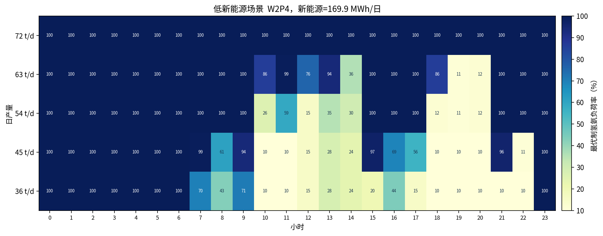

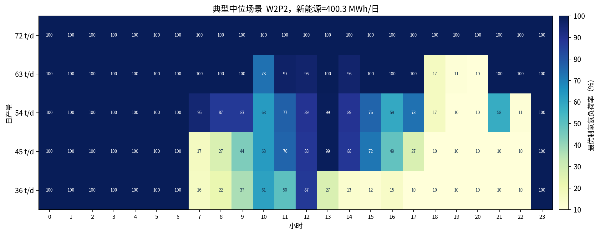

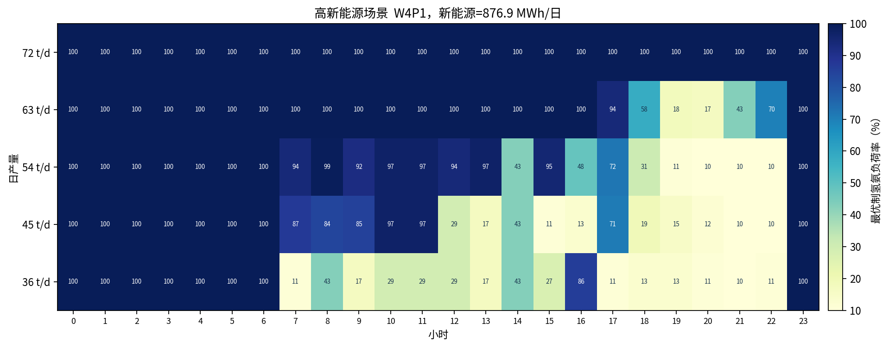

按五档日产量汇总 `24` 个场景后的指标如下。

问题三的场景聚合与问题二一致。对任一固定日产量 $Q$，先对每个场景求得最优连续负荷率 $y^*_{s,t}(Q)$，再计算：

$$
C^{ton}_{s,Q}=\frac{C^{day}_{s,Q}}{Q},\qquad
E^{buy}_{s,Q}=\sum_tP^{buy}_{s,t},\qquad
E^{sell}_{s,Q}=\sum_tP^{sell}_{s,t}
$$

表中的平均值、最大值、最小值仍按 24 个场景算术统计；绿电指标分类按三项阈值逐场景判定后计数。

| 日产量/t | 平均吨氨成本/(元/t) | 最小吨氨成本/(元/t) | 最大吨氨成本/(元/t) | 平均购电/MWh | 平均上网/MWh | 平均自发自用 | 平均绿电比例 | 平均上网比例 |
| -------: | --------------: | --------------: | --------------: | -----------: | -----------: | -----------: | -----------: | -----------: |
| 36 | 6432.59 | 3596.21 | 9165.22 | 253.03 | 170.28 | 46.83% | 54.71% | 26.59% |
| 45 | 6787.98 | 4256.03 | 9346.18 | 304.47 | 97.23 | 72.84% | 55.44% | 13.58% |
| 54 | 7146.76 | 4695.90 | 9589.96 | 381.33 | 49.59 | 87.08% | 52.79% | 6.46% |
| 63 | 7683.42 | 5155.42 | 10043.90 | 489.85 | 33.61 | 91.24% | 47.45% | 4.38% |
| 72 | 8293.78 | 6001.41 | 10384.36 | 614.30 | 33.55 | 91.26% | 41.87% | 4.37% |

五档日产量下绿电直连指标判定结果如下。

| 日产量/t | 全满足/场景 | 部分满足/场景 | 全不满足/场景 |
| -------: | ----------: | ------------: | ------------: |
| 36 | 11 | 13 | 0 |
| 45 | 16 | 8 | 0 |
| 54 | 16 | 8 | 0 |
| 63 | 20 | 4 | 0 |
| 72 | 18 | 6 | 0 |

五种固定日产量的全年产量、全年总成本和全年平均吨氨成本为：

这里沿用每个场景代表 15 天的代表年统计口径：

$$
Q_{\text{year}}(Q)=360Q,\qquad
C_{\text{year}}(Q)=\sum_s15C_{s,Q}^{day},\qquad
\bar C_{ton}(Q)=\frac{C_{\text{year}}(Q)}{360Q}
$$

| 日产量/t | 全年产量/t | 全年总成本/万元 | 全年平均吨氨成本/(元/t) |
| -------: | ---------: | --------------: | ------------------: |
| 36 | 12960 | 8336.64 | 6432.59 |
| 45 | 16200 | 10996.54 | 6787.98 |
| 54 | 19440 | 13893.31 | 7146.76 |
| 63 | 22680 | 17426.00 | 7683.42 |
| 72 | 25920 | 21497.48 | 8293.78 |

若每个场景均按最低吨氨成本选择日产量，则 `24` 个场景全部选择 `36 t/d`。对应全年总产量为：

$$
36\times24\times15=12960\text{ t}
$$

全年总成本为：

$$
8336.64\text{ 万元}
$$

全年平均吨氨成本为：

$$
6432.59\text{ 元/tNH3}
$$

该经济最优策略下，绿电直连指标分类为 `11` 个场景全满足、`13` 个场景部分满足、`0` 个场景全不满足。按每个场景代表 `15` 天计，对应全年 `165` 天全满足、`195` 天部分满足。

为说明“为什么最终都选 `36 t/d`”，下图给出 `24` 个场景和五档日产量的吨氨成本热力图，以及相对本场景最低成本的增量热力图。增量热力图中 `36 t/d` 一行均为 `0`，说明在当前成本参数下低产量方案在全部场景中均具有最低吨氨成本。

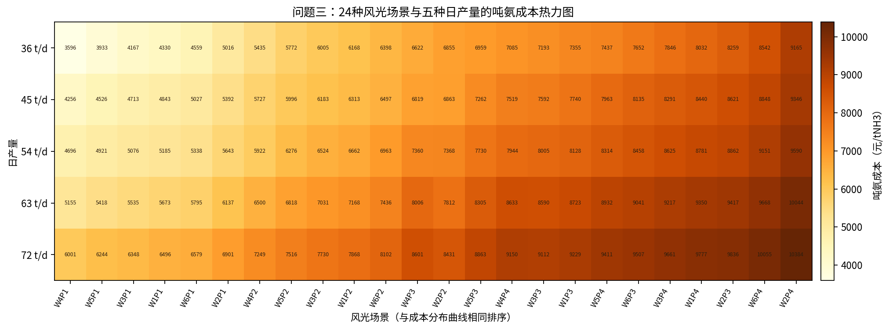

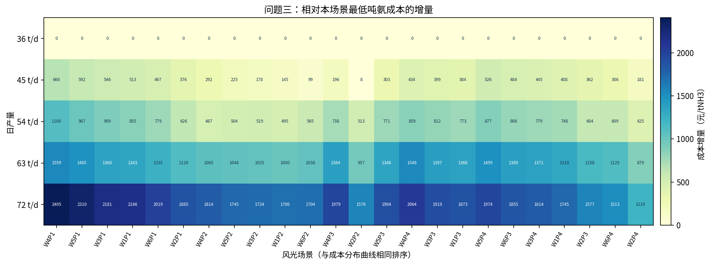

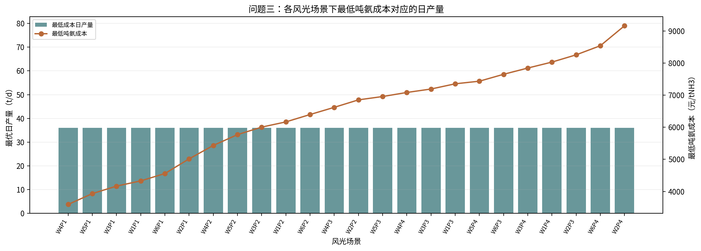

全年吨氨成本分布曲线如下。横坐标保留具体风光场景标签，纵坐标为各固定日产量在该场景下的吨氨成本。

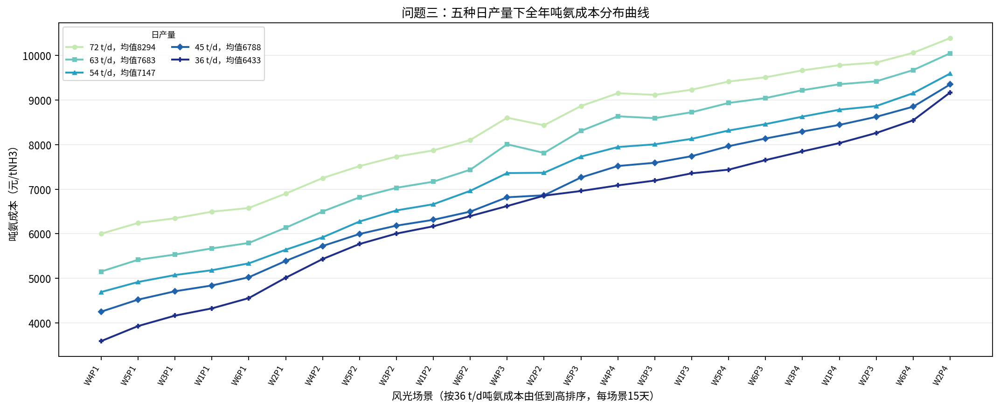

### 3.3 第（2）问：各场景运行状况及原因

从经济性看，日产量从 `36 t/d` 提高到 `72 t/d` 时，平均吨氨成本由 `6432.59 元/t` 增至 `8293.78 元/t`，平均日购电量由 `253.03 MWh` 增至 `614.30 MWh`。原因是高日产量需要在更多小时维持高负荷运行，低价或高风光时段不足后，新增产量必须由边际成本更高的购电小时承担。

从售电情况看，日产量提高会显著降低上网电量。平均上网量由 `36 t/d` 的 `170.28 MWh` 降至 `72 t/d` 的 `33.55 MWh`。这说明高产量能吸收更多新能源，但这种吸收是以更高购电量和更高运行成本为代价的。

从绿电直连指标看，产量提高使自发自用占比提高、上网比例降低。平均自发自用占比由 `46.83%` 升至 `91.26%`，平均上网比例由 `26.59%` 降至 `4.37%`。但绿电比例并不单调提高，在 `45 t/d` 附近达到较高水平，之后因外购电占比上升而下降。因此，较高产量更容易满足“自发自用”和“上网比例”指标，但不一定对应最低成本。

下图分别给出问题三下吨氨成本、购电量、上网量分布，以及三项绿电直连指标分布。

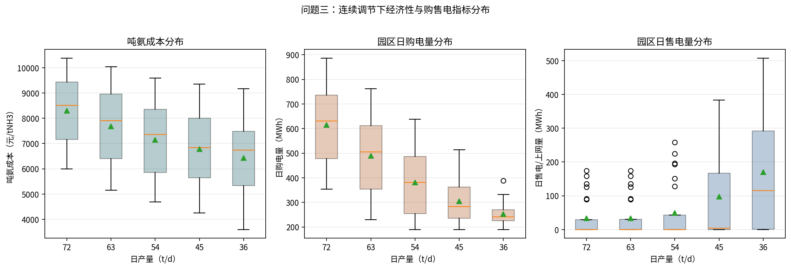

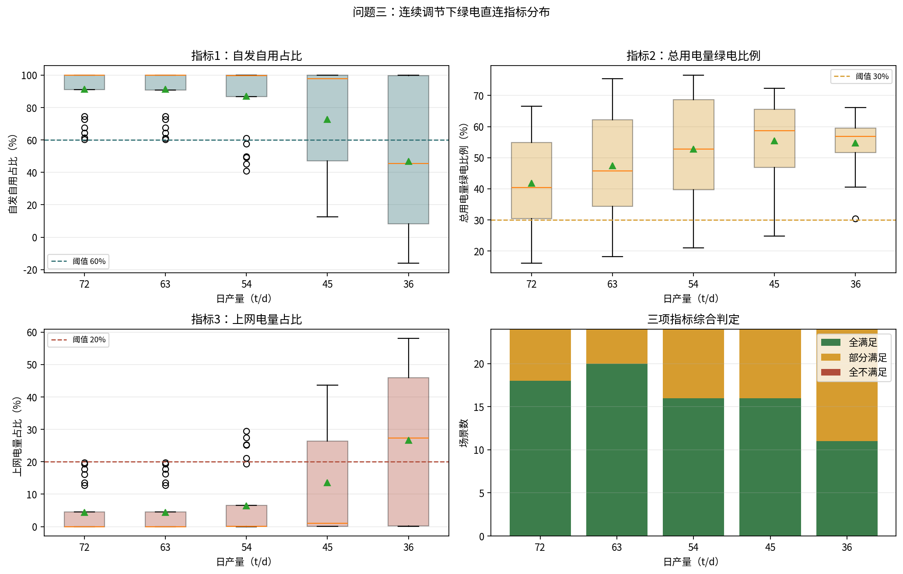

### 3.4 第（3）问：与问题二（2）的结果对比

问题二为离散开停，问题三为连续调节。二者均先计算 `24×5=120` 个固定日产量方案，再比较同一场景、同一产量下的指标变化。按产量汇总的对比如下，其中成本变化为“连续调节减离散开停”。

| 日产量/t | 离散平均吨氨成本 | 连续平均吨氨成本 | 平均成本变化 | 平均购电变化/MWh | 平均上网变化/MWh | 自发自用变化/百分点 | 绿电比例变化/百分点 | 上网比例变化/百分点 |
| -------: | --------------: | --------------: | -----------: | ---------------: | ---------------: | ------------------: | ------------------: | ------------------: |
| 36 | 6716.04 | 6432.59 | -283.45 | -44.97 | -44.97 | 29.33 | 8.05 | -14.67 |
| 45 | 7068.09 | 6787.98 | -280.11 | -51.02 | -51.02 | 30.56 | 7.47 | -15.28 |
| 54 | 7391.14 | 7146.76 | -244.37 | -36.03 | -36.03 | 19.68 | 4.46 | -9.84 |
| 63 | 7793.12 | 7683.42 | -109.69 | -19.76 | -19.76 | 8.64 | 2.12 | -4.32 |
| 72 | 8293.78 | 8293.78 | 0.00 | 0.00 | 0.00 | 0.00 | 0.00 | 0.00 |

可以看出，连续调节在 `36-63 t/d` 下均降低吨氨成本，其中 `36 t/d` 平均降低 `283.45 元/t`，降幅约 `4.22%`；`72 t/d` 时负荷率必须全时段为 `1`，连续调节退化为满负荷运行，因此与离散开停结果相同。

连续调节降低成本的原因是：低产量或中等产量下，模型可以把部分小时调整为 `10%` 最小负荷，把更多生产量分配到低电价或风光较好的小时，从而同时减少购电和上网。结果表现为购电量、上网量同步下降，新能源自用程度提高，绿电比例也有所改善。

问题二、问题三五档产量的综合对比见下图。

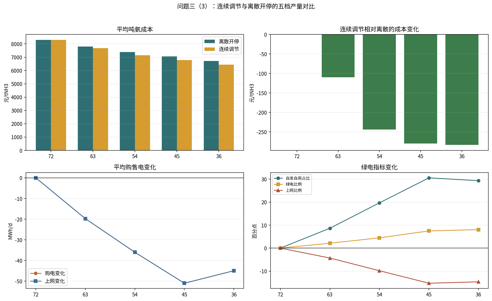

逐场景最低成本策略下，二者都选择 `36 t/d`，但问题三连续调节的逐场景成本整体低于问题二。下图给出经济最优策略下的逐场景吨氨成本对比。

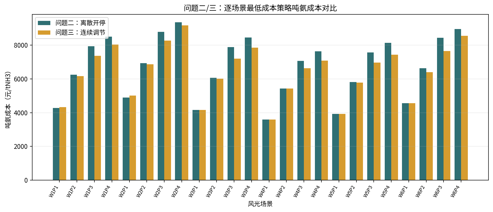

下图进一步给出 `24` 个场景、五档日产量下问题二与问题三的吨氨成本差值，纵轴为“离散开停减连续调节”。正值表示连续调节成本更低。

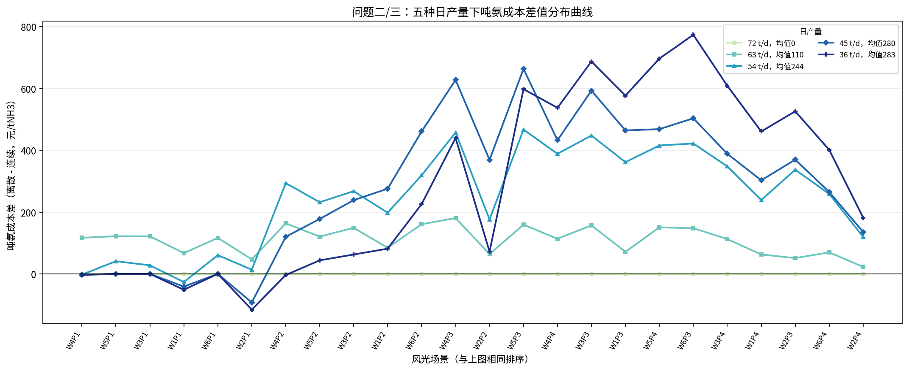

## 4. 问题四：离网运行与储能配置

问题四与问题二、三的主要区别是园区不再依赖电网兜底。离网时若仍强制制氨装置每小时不低于 `10%` 负荷，会在低风、夜间、无光时段造成不可行，因此本题引入停机变量。设扣除常规负荷后的可用于制氨和储能的剩余风光功率为：

$$
P^{res}_{s,t}=P^{re}_{s,t}-P^{base}_t
$$

制氨装置采用半连续运行约束：

$$
z_{s,t}\in\{0,1\},\qquad 0.1z_{s,t}\le y_{s,t}\le z_{s,t}
$$

其中 $z_{s,t}=0$ 表示停机，$z_{s,t}=1$ 表示开机；开机后负荷率不低于 `10%`，最高为满负荷。这样既符合题目给出的最低负荷率约束，也允许离网低出力时段停机。

第四题的吨氨成本公式与并网问题不同。题干将问题四定义为“园区离网运行”，因此本题不再计算网购电成本和余电上网收益；风光富余时只能弃电，风光不足时只能停机、由储能补偿或形成常规负荷缺供记录。无储能离网日成本为：

$$
\begin{aligned}
C^{off}_{s,day}
=&\ 1000C_w\sum_t P^w_{s,t}
+1000C_{pv}\sum_t P^{pv}_{s,t}\\
&+1000c^{om}_{ALK}\sum_t 20y_{s,t}
+1000c^{om}_{PEM}\sum_t 20y_{s,t}\\
&+1000c^{om}_{NH3}\sum_t 1.5y_{s,t}
+C^{cap}_{NH3}.
\end{aligned}
$$

有储能时增加储能投资日摊销和储能充放电运维成本：

$$
C^{off,bat}_{s,day}
=C^{off}_{s,day}
+\frac{1000E^{bat}C^{cap}_{bat}}{15\times360}
+1000c^{om}_{bat}\sum_t\left(P^{ch}_{s,t}+P^{dis}_{s,t}\right)
$$

日产量和吨氨成本分别为：

$$
Q_s=3\sum_t y_{s,t},\qquad C_{s,ton}=\frac{C_{s,day}}{Q_s}.
$$

其中 $C^{cap}_{bat}=1000\text{ 元/kWh}$，$c^{om}_{bat}=0.01\text{ 元/kWh}$。注意：$P^{loss}_{s,t}$ 只用于记录离网条件下常规负荷未被风光或储能覆盖的缺供量，调度求解时赋予高惩罚以尽量避免缺供；本文报告的吨氨成本未额外计入缺供罚金或备用电源成本。因此无储能场景中的少量常规负荷缺供会体现在能源自给状况中，但不会作为罚款直接进入吨氨成本分子。

### 4.1 第（1）问：无储能离网运行与最小风光装机

无储能时不允许外购电和上网，且无法跨时段转移电量。若剩余风光功率不足 `10%` 制氨负荷，则该小时停机；若剩余风光功率超过满负荷需求，则最多只能满负荷运行，多余电量记为弃电：

$$
y_{s,t}=
\begin{cases}
0, & P^{res}_{s,t}<0.1P^{NH3}_{\max},\\
\min\left(1,\dfrac{P^{res}_{s,t}}{P^{NH3}_{\max}}\right), & P^{res}_{s,t}\ge0.1P^{NH3}_{\max}.
\end{cases}
$$

其中 $P^{NH3}_{\max}=41.5\text{ MW}$。若 $P^{res}_{s,t}<0$，说明该小时常规负荷也不能完全由风光供给，记为常规负荷缺供。本数据下常规负荷最大缺供量为 `0.138 MWh/日`。

各日发电场景下的完整无储能离网运行结果已导出至 `outputs/q4_offgrid_no_storage.csv`。正文用排序棒棒糖图展示 24 个场景的产量和吨氨成本分布，红圈表示存在常规负荷缺供的场景。

无储能离网下，场景 $s$ 的弃电量和常规负荷缺供量按下式计算：

$$
E^{curt}_s=\sum_t\max(P^{res}_{s,t}-P^{NH3}_{\max}y_{s,t},0)
$$

$$
E^{loss}_s=\sum_t\max(-P^{res}_{s,t},0)
$$

相应的风光发电利用率可写为：

$$
\rho^{re}_s=1-\frac{E^{curt}_s}{\sum_tP^{re}_{s,t}}
$$

全年弃电量和缺供量均按每场景 15 天加权：

$$
E^{curt}_{year}=\sum_s15E^{curt}_s,\qquad
E^{loss}_{year}=\sum_s15E^{loss}_s
$$

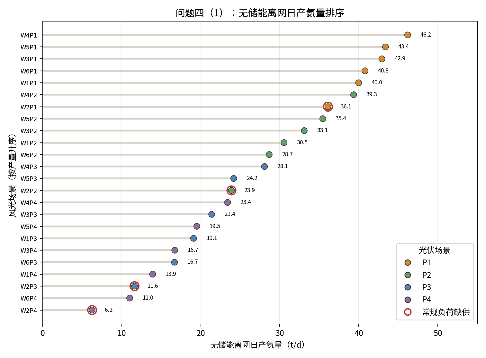

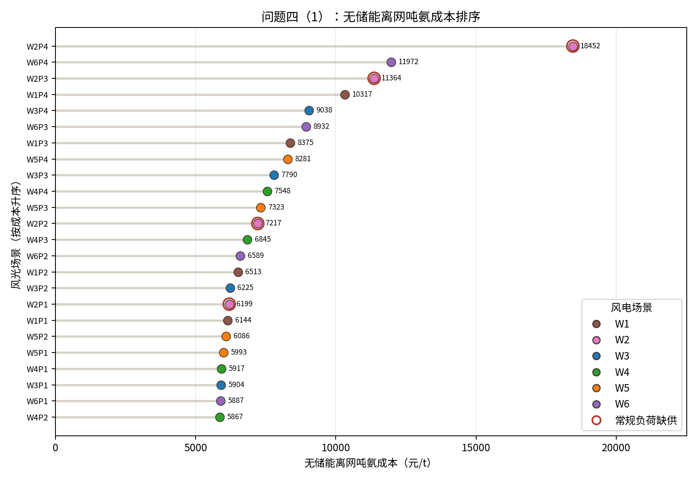

主要极端场景如下。

| 指标 | 场景 | 数值 |
| ---- | ---- | ---: |
| 最低日产量 | W2P4 | 6.25 t/d |
| 最高日产量 | W4P1 | 46.19 t/d |
| 最低吨氨成本 | W4P2 | 5866.79 元/t |
| 最高吨氨成本 | W2P4 | 18452.00 元/t |
| 最大弃电量 | W4P1 | 177.29 MWh/d |
| 常规负荷缺供场景 | W2P1-W2P4 | 0.138 MWh/d |

按 `24` 个场景、每个场景代表 `15` 天的 `360` 天代表年统计，无储能离网年度结果为：

| 指标                 |            数值 |
| -------------------- | --------------: |
| 日产量最小值         |          6.25 t |
| 日产量最大值         |         46.19 t |
| 全年制氨总量         |       9781.56 t |
| 氢氨年平均产能利用率 |         37.74% |
| 全年平均吨氨成本     | 7000.63 元/tNH3 |
| 全年弃电量           | 14188.67 MWh |
| 常规负荷最大缺供量   | 0.138 MWh/日 |
| 最大弃电场景         | W4P1 |
| W4P1 弃电量          | 177.29 MWh/日 |

第（1）问结论：无储能离网时，风光曲线与制氨负荷曲线错配明显。高风高光场景白天存在大量弃电，但制氨装置受 `41.5 MW` 满负荷功率限制不能继续消纳；低风低光或夜间出力不足时，制氨装置只能停机。因此无储能离网年产量仅为 `9781.56 t`，产能利用率为 `37.74%`。

若进一步要求不配置储能、不购电时所有场景所有小时均能同时满足常规负荷和 `72 t/d` 满产制氨负荷，并保持现有风光装机比例整体放大，则需要满足：

$$
k\left(P^w_{s,t}+P^{pv}_{s,t}\right)\ge P^{base}_t+P^{NH3}_{\max},\qquad \forall s,t
$$

计算得到最小整体放大倍数为：

$$
k=28.91
$$

对应最小风电、光伏装机估算为：

$$
P^w_{\min}=1156.31\text{ MW},\qquad P^{pv}_{\min}=1850.09\text{ MW}
$$

该装机需求很大，根本原因是最差风光场景的夜间风电出力很低且光伏为零。工程上若仅依靠扩建风光保证离网满产，会导致极端场景约束下的装机冗余，因此通常需要结合储能、备用电源或可中断生产。

### 4.2 第（2）问：储能容量配置与 24 场景运行效果

储能用于把高出力时段的弃电转移到低出力时段使用。储能参数取附件给定值：充电效率 `90%`，放电效率 `90%`，自损耗率 `0.2%/h`，投资成本 `1000 元/kWh`，寿命 `15` 年，运维成本 `0.01 元/kWh`。

储能状态方程为：

$$
SOC_{s,t}=(1-\lambda)SOC_{s,t-1}+\eta_cP^{ch}_{s,t}-\frac{P^{dis}_{s,t}}{\eta_d}
$$

容量约束和离网功率平衡为：

$$
0\le SOC_{s,t}\le E^{bat},\qquad P^{ch}_{s,t}\ge0,\qquad P^{dis}_{s,t}\ge0
$$

$$
P^{re}_{s,t}+P^{dis}_{s,t}+P^{loss}_{s,t}
=P^{base}_t+P^{NH3}_{\max}y_{s,t}+P^{ch}_{s,t}+P^{curt}_{s,t}
$$

其中 $P^{loss}_{s,t}$ 为常规负荷缺供松弛变量，只用于保证极低出力时模型可行，并在目标函数中赋予高惩罚。制氨装置仍满足半连续约束：

$$
z_{s,t}\in\{0,1\},\qquad 0.1z_{s,t}\le y_{s,t}\le z_{s,t}
$$

对给定储能容量 $E^{bat}$，调度目标为在满足离网功率平衡和储能约束下最大化日产量、同时减少弃电和缺供。代码中等价采用带高惩罚项的线性目标：

$$
\min\left[
-3\sum_ty_{s,t}
+\epsilon_1\sum_t(P^{ch}_{s,t}+P^{dis}_{s,t})
+\epsilon_2\sum_tP^{curt}_{s,t}
+M\sum_tP^{loss}_{s,t}
\right]
$$

其中 $M$ 取很大值，用于优先避免常规负荷缺供；$\epsilon_1,\epsilon_2$ 为很小的正数，用于在同等产量下减少无效充放电和弃电。得到各容量下的最优调度后，再按离网储能吨氨成本公式计算 $C^{off,bat}_{s,ton}$，选择吨氨成本最低的储能容量。

计算上采用 `linprog + 分支定界` 求解 24 小时小规模半连续模型：先解连续松弛，若出现 $0<y_{s,t}<0.1$ 的非法低负荷，则分支为停机 $y_{s,t}=0$ 或开机 $y_{s,t}\ge0.1$。输出表中最小正负荷率为 `0.1`，说明没有出现低于 `10%` 的非法运行小时。

以无储能最大弃电场景 `W4P1` 为储能配置基准，扫描 `0-300 MWh` 储能容量，吨氨成本最低的容量为：

$$
E^{bat,*}=\arg\min_{E^{bat}\in\{0,1,\ldots,300\}}
\frac{C^{off,bat}_{W4P1,day}(E^{bat})}{Q^{off,bat}_{W4P1}(E^{bat})}
$$

$$
E^{bat}=155\text{ MWh}
$$

该容量下 `W4P1` 的运行结果如下。

| 指标     |       无储能 | 155 MWh 储能 |
| -------- | -----------: | ------------: |
| 日产量   |      46.19 t |       56.45 t |
| 弃电量   |  177.29 MWh |      0.00 MWh |
| 吨氨成本 | 5916.87 元/t | 5708.01 元/t |

将 `155 MWh` 储能容量应用于全部 24 个风光场景，得到储能前后的产量对比如下。

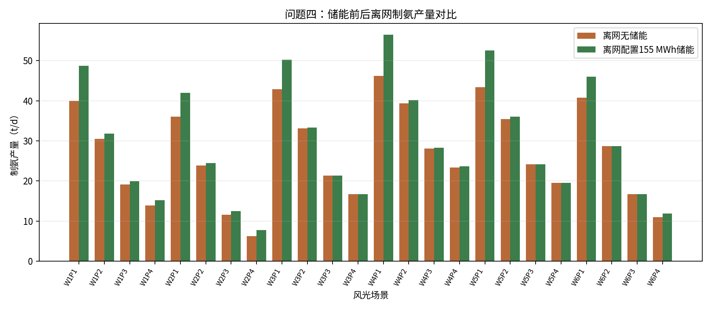

| 场景 | 无储能产量/t | 无储能成本/(元/t) | 无储能弃电/MWh | 有储能产量/t | 有储能成本/(元/t) | 有储能弃电/MWh |
| ---- | -----------: | ------------: | -------------: | -----------: | ------------: | -------------: |
| W1P1 | 40.0 | 6143.94 | 147.9 | 48.7 | 5981.85 | 0.0 |
| W1P2 | 30.5 | 6512.71 | 20.1 | 31.9 | 7218.63 | 0.0 |
| W1P3 | 19.1 | 8374.93 | 12.6 | 19.9 | 9533.60 | 0.0 |
| W1P4 | 13.9 | 10316.64 | 19.7 | 15.2 | 11446.83 | 0.0 |
| W2P1 | 36.1 | 6198.71 | 99.0 | 41.9 | 6289.36 | 0.0 |
| W2P2 | 23.9 | 7216.63 | 9.4 | 24.5 | 8249.31 | 0.0 |
| W2P3 | 11.6 | 11364.49 | 13.3 | 12.5 | 12958.85 | 0.0 |
| W2P4 | 6.2 | 18452.00 | 22.9 | 7.8 | 18836.85 | 0.0 |
| W3P1 | 42.9 | 5904.27 | 126.4 | 50.2 | 5905.49 | 0.0 |
| W3P2 | 33.1 | 6224.52 | 3.7 | 33.3 | 7058.38 | 0.0 |
| W3P3 | 21.4 | 7790.46 | 0.0 | 21.4 | 9132.81 | 0.0 |
| W3P4 | 16.7 | 9038.40 | 0.0 | 16.7 | 10756.12 | 0.0 |
| W4P1 | 46.2 | 5916.87 | 177.3 | 56.5 | 5708.01 | 0.0 |
| W4P2 | 39.3 | 5866.79 | 13.3 | 40.2 | 6499.29 | 0.0 |
| W4P3 | 28.1 | 6845.38 | 3.6 | 28.3 | 7813.77 | 0.0 |
| W4P4 | 23.4 | 7547.92 | 3.6 | 23.6 | 8700.27 | 0.0 |
| W5P1 | 43.4 | 5993.17 | 158.6 | 52.5 | 5840.87 | 0.0 |
| W5P2 | 35.4 | 6086.15 | 9.9 | 36.0 | 6817.53 | 0.0 |
| W5P3 | 24.2 | 7323.43 | 0.0 | 24.2 | 8510.91 | 0.0 |
| W5P4 | 19.5 | 8280.97 | 0.0 | 19.5 | 9753.01 | 0.0 |
| W6P1 | 40.8 | 5886.73 | 90.8 | 46.0 | 6064.41 | 0.0 |
| W6P2 | 28.7 | 6589.08 | 0.0 | 28.7 | 7590.56 | 0.0 |
| W6P3 | 16.7 | 8932.23 | 0.0 | 16.7 | 10653.22 | 0.0 |
| W6P4 | 11.0 | 11972.41 | 13.8 | 11.9 | 13577.53 | 0.0 |

年度汇总如下。

| 指标             |       无储能 | 155 MWh 储能 |
| ---------------- | -----------: | ------------: |
| 全年制氨总量     |    9781.56 t |   10623.84 t |
| 年平均产能利用率 |       37.74% |       40.99% |
| 全年平均吨氨成本 | 7000.63 元/t | 7571.73 元/t |
| 全年弃电量       | 14188.67 MWh |     0.00 MWh |

第（2）问结论：`155 MWh` 储能能够把 `W4P1` 场景的弃电从 `177.29 MWh/日` 降至 `0`，日产量由 `46.19 t` 提高到 `56.45 t`，并使该场景吨氨成本下降。推广到全年 24 个场景后，储能将全年弃电量降为 `0`，年制氨量由 `9781.56 t` 提高到 `10623.84 t`，产能利用率由 `37.74%` 提高到 `40.99%`。但由于储能投资和运维成本较高，全年平均吨氨成本由 `7000.63 元/t` 上升到 `7571.73 元/t`。

### 4.3 第（3）问：相同制氨产量下离网与联网经济性对比

为公平比较离网和联网模式，不能直接用不同产量方案比较吨氨成本。本文将“离网 `155 MWh` 储能方案”在各场景下的日产量作为目标需求，再用问题三的并网连续调节模型计算相同产量需求下的并网运行结果。由于并网连续模型采用 `0.01` 负荷率步长，年产量存在很小离散误差。

设离网储能方案在场景 $s$ 下的日产量为 $Q^{off,bat}_s$，则联网对照模型为：

$$
\sum_t3y^{grid}_{s,t}=Q^{off,bat}_s,\qquad 0.1\le y^{grid}_{s,t}\le1
$$

并按并网功率平衡计算购售电：

$$
P^{buy}_{s,t}=\max(P^{base}_t+41.5y^{grid}_{s,t}-P^{re}_{s,t},0)
$$

$$
P^{sell}_{s,t}=\max(P^{re}_{s,t}-P^{base}_t-41.5y^{grid}_{s,t},0)
$$

目标函数仍为包含购电成本和上网收益的并网日净成本最小。这样比较的是“完成同等制氨产量时，依赖电网平衡”和“依赖储能离网平衡”的经济差异。

在相同 `24` 场景、每场景 `15` 天的代表年口径下，各模式汇总如下。

| 模式                    | 年产量/t | 平均吨氨成本/(元/t) | 产能利用率 | 主要特征 |
| ----------------------- | -------: | --------------: | ---------: | -------- |
| 并网，问题二离散最优    | 12960.00 | 6716.04 | 50.00% | 只能选择离散产量，经济最优为较低产量 |
| 并网，问题三连续最优    | 12960.00 | 6432.59 | 50.00% | 负荷连续调节，调度更精细，成本更低 |
| 离网，无储能            | 9781.56 | 7000.63 | 37.74% | 无法跨时段转移电量，弃电与停机并存 |
| 离网，155 MWh 储能      | 10623.84 | 7571.73 | 40.99% | 消除弃电并提高产量，但储能投资较高 |
| 并网，同离网储能产量    | 10624.05 | 6321.97 | 40.99% | 按离网储能各场景产量作为需求曲线 |

第（3）问结论：在相同制氨产量需求下，并网方案平均吨氨成本为 `6321.97 元/t`，明显低于离网 `155 MWh` 储能方案的 `7571.73 元/t`。原因是并网模式可以在风光不足时购电、在风光富余时上网，电网承担了部分跨时段和跨场景平衡功能；离网模式必须依靠储能完成平衡，且储能投资成本较高。因此在当前参数下，离网储能的主要价值是提高新能源自给能力、消除弃电和增强离网可运行性，而不是降低吨氨成本。
